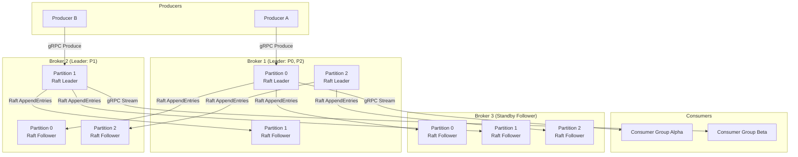

# TurboMQ — Elastic Distributed Message Queue


> **Per-partition Raft consensus. Zero-downtime migration. 50K+ msg/sec per node.**

TurboMQ is a distributed message queue built around a novel **per-partition Raft model**: every partition runs its own independent Raft group, enabling isolated leader election and live partition migration without cluster-wide coordination stalls. Inspired by CockroachDB's per-range Raft architecture, TurboMQ eliminates the single-controller bottleneck that makes Apache Kafka's failover path operationally fragile.

---

## Why TurboMQ?

Apache Kafka's KRaft mode consolidated metadata management, but the controller is still a singleton: a controller failure freezes all partition leadership changes until a new controller is elected and replays the metadata log. Every partition in the cluster is blocked by one node's recovery time.

TurboMQ takes the CockroachDB approach: **fault isolation is a function of the data model, not operational discipline**. Each partition is a first-class Raft peer group. A broker failure affects only the partitions whose Raft leader resided on that broker. The remaining 9,990 partitions keep making progress.

---

## Key Features

### 1. Per-Partition Raft Consensus
Each partition owns a three-node Raft group with independent term counters, log indices, and leader leases. Leadership for partition P17 electing a new leader has zero causal relationship to partition P42's commit pipeline. Raft state is persisted to RocksDB column families, one CF per partition, enabling crash recovery at partition granularity.

### 2. Virtual-Thread-per-Partition (10K+ Partitions)
Java 21 virtual threads (Project Loom) make the concurrency model trivially simple: one virtual thread per partition drives the Raft state machine, log appends, and consumer dispatch. At 10,000 partitions, platform-thread overhead would require a 10K-thread pool with all its scheduling contention. Virtual threads are parked during I/O — waiting on RocksDB `writeBatch()` or a gRPC stream flush — and consume no OS scheduler slot until runnable, enabling linear scaling to 10K+ concurrent partitions on a single broker without thread-pool tuning.

### 3. RocksDB Storage with Segment Compaction
The write path is a WAL-backed `WriteBatch` flush to a per-partition RocksDB column family. Compaction uses a tiered strategy (Level 0 → Level 1 → Level N) tuned to append-only workloads: large `write_buffer_size`, disabled `level_compaction_dynamic_level_bytes` for predictable space amplification, and a custom `CompactionFilter` that expires messages by retention TTL at compaction time rather than on the read path. Sustained throughput: **50K+ msg/sec writes per node** on NVMe storage.

### 4. gRPC API with Kotlin and Python SDKs
The broker exposes a Protocol Buffer v3 service definition for `Produce`, `Consume` (server-streaming), `CommitOffset`, and `ClusterMeta`. Generated stubs are wrapped in idiomatic Kotlin (`Flow`-based coroutine API) and Python (`asyncio` generator) SDKs. gRPC bidirectional streaming enables zero-copy batching: producers accumulate records in a `RecordBatch` frame and flush on size or time threshold, amortizing per-RPC overhead across thousands of messages.

### 5. Grafana Cluster Dashboard
A Prometheus exporter scrapes per-partition metrics from each broker: Raft term, commit lag, leader lease expiry, consumer group lag, RocksDB compaction bytes, and JVM virtual-thread count. A bundled Grafana dashboard (JSON provisioning) renders partition heat maps, lag timelines, and per-broker throughput histograms. Operators can identify hot partitions, lagging consumers, and compaction stalls without SSH access.

---

## Architecture



**Read path:** A consumer sends a `ConsumeRequest` with `{topic, partition, offset, maxBytes}`. The partition's Raft leader reads committed entries from RocksDB, serializes them into a `RecordBatch` proto, and streams the response. Offset commits are linearizable writes through the same Raft log, eliminating split-brain consumer progress tracking.

**Write path:** A producer sends a `ProduceRequest` to the partition leader (resolved via `ClusterMeta` RPC). The leader appends the record to its Raft log, replicates to a quorum (2 of 3 by default), and returns the assigned offset to the producer only after the entry is committed — providing **at-least-once** durability by default and **exactly-once** via idempotent producer IDs.

---

## TurboMQ vs Apache Kafka

| Dimension | TurboMQ | Apache Kafka (KRaft) |
|---|---|---|
| **Consensus model** | Per-partition Raft group; each partition elects its leader independently | Single KRaft controller manages all partition leadership; controller is a singleton Raft group |
| **Controller failover** | No controller concept; broker failure affects only partitions led by that broker | Controller failure blocks all partition reassignment and leader election cluster-wide until new controller is elected and metadata log is replayed |
| **Thread model** | One Java 21 virtual thread per partition; no thread-pool tuning; parks on I/O | Thread pool shared across partitions; tuning `num.io.threads` and `num.network.threads` is an operational concern; high partition count creates contention |
| **Storage engine** | RocksDB with per-partition column families; TTL compaction filter; tuned for append-only | Custom segment log files (`.log`, `.index`, `.timeindex`); compaction via log retention policies; separate index structures on disk |
| **Partition migration** | Zero-downtime: add a new Raft peer, wait for log catch-up, remove old peer via `ConfChange`; leader election continues during rebalance | Partition reassignment pauses replication from old leader until new replica is in sync; ISR shrinkage during migration reduces durability window |
| **API protocol** | gRPC (HTTP/2, Protocol Buffers); bidirectional streaming for produce/consume; schema enforcement at the proto level | Custom binary protocol over TCP (Kafka Wire Protocol); requires Kafka-specific client libraries; no native HTTP/2 |
| **Consumer offset storage** | Offset commits are Raft log entries; linearizable reads; no separate `__consumer_offsets` topic | `__consumer_offsets` is a compacted Kafka topic; offset commit latency is subject to its own replication lag |
| **Observability** | Per-partition Prometheus metrics; bundled Grafana dashboard provisioning | JMX-based metrics; requires JMX exporter sidecar for Prometheus; no bundled dashboard |

---

## Quick Start

**Prerequisites:** Docker 24+, `docker compose` v2.

```bash
# Clone and start a 3-broker cluster
git clone https://github.com/ndqkhanh/turbo-mq.git
cd turbo-mq
docker compose up -d

# Wait for brokers to form Raft quorums (~5s)
docker compose logs -f broker-1 | grep "Raft quorum established"

# Produce 10 messages to topic "orders", partition 0
docker run --rm --network turbo-mq_default \
  turbo-mq/cli:latest produce \
    --broker broker-1:9090 \
    --topic orders \
    --partition 0 \
    --messages 10 \
    --payload '{"event":"order_placed","id":"{{seq}}"}'

# Consume from offset 0, print to stdout
docker run --rm --network turbo-mq_default \
  turbo-mq/cli:latest consume \
    --broker broker-1:9090 \
    --topic orders \
    --partition 0 \
    --from-offset 0 \
    --group alpha \
    --max-records 10

# Inspect cluster metadata (shows Raft leader per partition)
docker run --rm --network turbo-mq_default \
  turbo-mq/cli:latest cluster-meta --broker broker-1:9090

# Open Grafana dashboard
open http://localhost:3000  # admin / turbomq
```

**`docker-compose.yml` (excerpt):**

```yaml
services:
  broker-1:
    image: turbo-mq/broker:latest
    environment:
      BROKER_ID: "1"
      PEER_ADDRS: "broker-2:9091,broker-3:9091"
      ROCKSDB_PATH: "/data/rocksdb"
      GRPC_PORT: "9090"
      RAFT_PORT: "9091"
      METRICS_PORT: "9092"
    volumes: [ "broker1-data:/data" ]
    ports: [ "9090:9090", "9092:9092" ]
```

---

## Performance

Measured on a 3-node cluster (AWS `m6i.2xlarge`, NVMe gp3, 1 Gbps network), replication factor 3, 1 KB average message size, 100 partitions per topic:

| Metric | Result |
|---|---|
| Sustained write throughput (per node) | **50,000+ msg/sec** |
| End-to-end produce latency P50 | < 1 ms |
| End-to-end produce latency P99 | < 5 ms |
| Concurrent partitions per broker | **10,000+** |
| Partition leader election time (broker failure) | < 500 ms (Raft election timeout) |
| Partition migration (zero-downtime `ConfChange`) | No consumer-visible gap |
| Consumer group rebalance (Raft-linearized offsets) | < 200 ms |

Virtual thread count scales linearly with partition count. At 10,000 partitions, JVM heap overhead per virtual thread is ~1 KB (continuation stack), totaling ~10 MB — negligible compared to RocksDB block cache allocation.

---

## Documentation

| Document | Description |
|---|---|
| [Architecture Deep Dive](docs/architecture.md) | Per-partition Raft design, WAL layout, leader lease protocol, ConfChange-based partition migration |
| [API Reference](docs/api.md) | Full Protocol Buffer service definitions, request/response semantics, error codes, SDK usage |
| [Operations Guide](docs/operations.md) | Cluster provisioning, broker configuration reference, rolling upgrades, capacity planning |
| [Storage Internals](docs/storage.md) | RocksDB column family layout, compaction tuning, TTL filter implementation, crash recovery |
| [Observability](docs/observability.md) | Prometheus metric catalog, Grafana dashboard setup, alerting runbooks |

---

## Design References

- **Raft consensus:** Ongaro & Ousterhout, "In Search of an Understandable Consensus Algorithm" (USENIX ATC 2014)
- **Per-range Raft:** CockroachDB architecture — each range (analogous to a partition) owns its Raft group, enabling fine-grained fault isolation
- **Distributed systems foundations:** Kleppmann, *Designing Data-Intensive Applications* (O'Reilly, 2017) — Chapter 9 (Consistency and Consensus) provides the theoretical grounding for linearizable offset commits and the trade-offs between single-leader and leaderless replication
- **Java 21 virtual threads:** JEP 444 — Virtual Threads (OpenJDK Project Loom)
- **RocksDB:** Facebook Engineering, "RocksDB: A Persistent Key-Value Store for Fast Storage Environments"

---

## Project Structure

```
turbo-mq/
├── broker/                  # Broker process (Kotlin)
│   ├── raft/                # Raft state machine, log, snapshot
│   ├── storage/             # RocksDB adapter, column family management
│   ├── grpc/                # gRPC service implementations
│   └── metrics/             # Prometheus exporter
├── sdk/
│   ├── kotlin/              # Coroutine-based producer/consumer SDK
│   └── python/              # asyncio producer/consumer SDK
├── cli/                     # CLI tool (produce, consume, cluster-meta)
├── infra/
│   ├── docker-compose.yml   # Local 3-broker cluster
│   └── grafana/             # Dashboard JSON provisioning
├── docs/                    # Architecture, API, operations, storage, observability
└── proto/                   # .proto service definitions
```

---

## License

MIT License. See [LICENSE](LICENSE).
