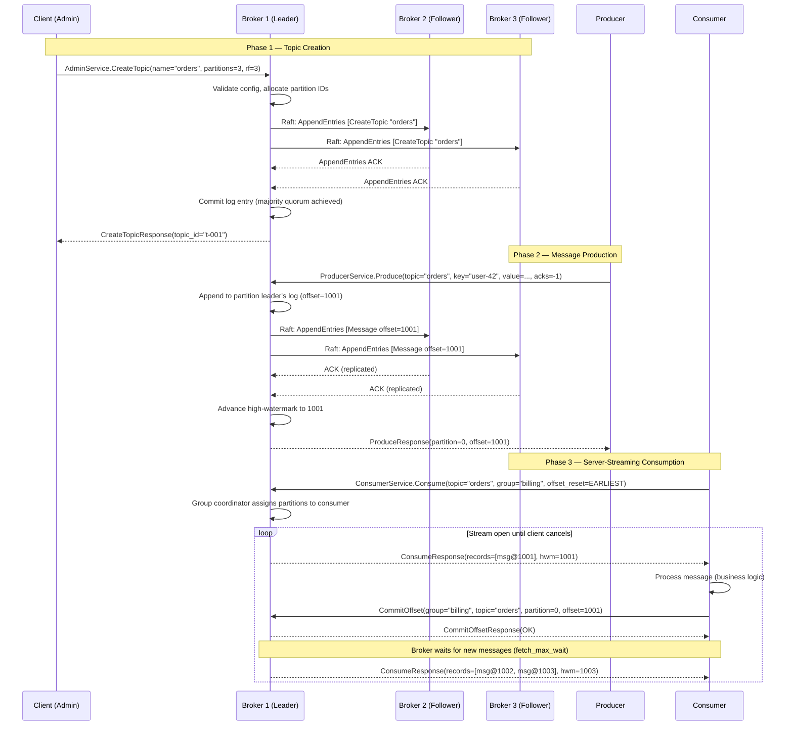
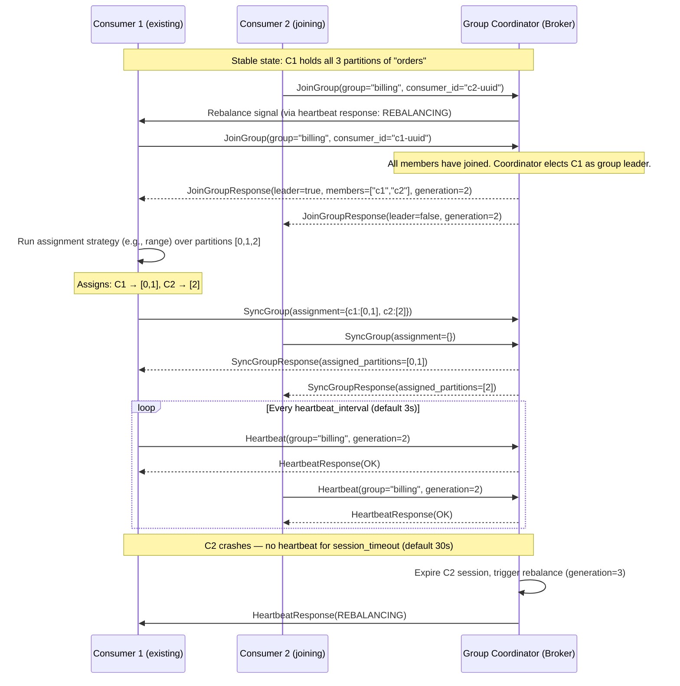
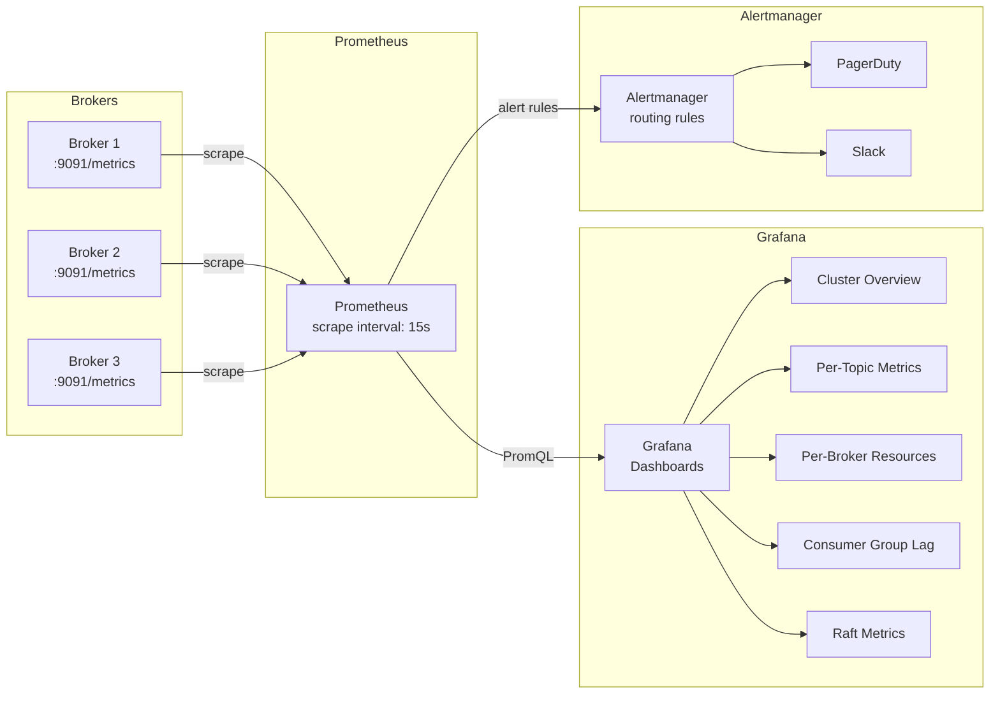

# TurboMQ API & SDKs

Deep-dive reference covering the gRPC API surface, delivery guarantees, client SDKs, and observability. Intended for engineers integrating with or operating TurboMQ clusters.

---

## Table of Contents

1. [API Design Principles](#1-api-design-principles)
2. [Service Definitions (protobuf)](#2-service-definitions-protobuf)
3. [API Interaction Flow](#3-api-interaction-flow)
4. [Consumer Groups](#4-consumer-groups)
5. [Delivery Guarantees](#5-delivery-guarantees)
6. [Kotlin SDK](#6-kotlin-sdk)
7. [Python SDK](#7-python-sdk)
8. [Grafana Dashboard](#8-grafana-dashboard)
9. [Design Decisions (ADR)](#9-design-decisions-adr)
10. [See Also](#10-see-also)

---

## 1. API Design Principles

TurboMQ exposes its entire public surface through **gRPC over HTTP/2**. There is no REST/JSON API by design — the decision is architectural, not incidental.

### Why gRPC

| Concern | REST/HTTP 1.1 | gRPC/HTTP2 |
|---|---|---|
| Streaming | Requires SSE/WebSocket workaround | First-class server/client/bidirectional streaming |
| Serialization | JSON (verbose, runtime parse) | Protobuf (binary, schema-validated, 3-10x smaller) |
| Code generation | OpenAPI tooling (inconsistent quality) | `protoc` generates idiomatic stubs in 10+ languages |
| Multiplexing | One request per TCP connection | Multiple streams over single connection |
| Backpressure | Application-level only | HTTP/2 flow control at transport layer |

The consumption pattern — where a consumer holds a long-lived connection and receives a continuous stream of messages — maps naturally to gRPC server-side streaming. Emulating this over REST requires polling or SSE with significant overhead.

### Three Services

TurboMQ exposes exactly three gRPC services, each with a single responsibility:

- **ProducerService** — write messages to topics; supports single and batch produce
- **ConsumerService** — read messages from partitions; server-streaming delivery, offset management
- **AdminService** — cluster and topic lifecycle; topic CRUD, cluster introspection

All services share a single port (default `9090`). TLS and mutual TLS are supported via standard gRPC interceptors on the broker side.

### Protobuf as the Contract

All messages are defined in `proto3`. The `.proto` files are the canonical source of truth for the API contract. Clients generate their stubs from these definitions using `protoc` with language-specific plugins. This guarantees:

- Type safety across all languages
- Forward/backward compatibility through field numbering conventions
- No runtime schema negotiation (unlike Avro with a schema registry)

---

## 2. Service Definitions (protobuf)

### 2.1 Package Header

```protobuf
syntax = "proto3";

package turbomq.v1;

option java_package = "io.turbomq.proto.v1";
option java_multiple_files = true;
option go_package = "github.com/turbomq/turbomq-go/proto/v1";

import "google/protobuf/timestamp.proto";
import "google/protobuf/duration.proto";
```

### 2.2 Common Types

```protobuf
// A single message record as stored in a partition log.
message Message {
  // Logical offset within the partition. Set by the broker; ignored on produce.
  int64 offset = 1;

  // Partition key used for routing. If empty, round-robin assignment applies.
  bytes key = 2;

  // Message payload. Opaque bytes; TurboMQ does not inspect content.
  bytes value = 3;

  // Optional headers: arbitrary key-value metadata (e.g., trace IDs, content-type).
  map<string, bytes> headers = 4;

  // Wall-clock time the broker assigned when appending to the log.
  google.protobuf.Timestamp timestamp = 5;

  // Partition index this message was written to. Set by broker on response.
  int32 partition = 6;
}

// Identifies a specific position in a partition log.
message PartitionOffset {
  string topic     = 1;
  int32  partition = 2;
  int64  offset    = 3;
}

// Result of a single produce operation.
message ProduceResult {
  string topic     = 1;
  int32  partition = 2;
  int64  offset    = 3;
  google.protobuf.Timestamp timestamp = 4;
}

enum ErrorCode {
  OK                    = 0;
  UNKNOWN_TOPIC         = 1;
  INVALID_PARTITION     = 2;
  NOT_LEADER            = 3;       // Client should retry against leader
  LEADER_NOT_AVAILABLE  = 4;       // Raft election in progress
  OFFSET_OUT_OF_RANGE   = 5;
  GROUP_REBALANCING     = 6;
  DUPLICATE_SEQUENCE    = 7;       // Idempotent producer: already committed
  TRANSACTION_ABORTED   = 8;
  QUOTA_EXCEEDED        = 9;
  AUTH_FAILURE          = 10;
}
```

### 2.3 ProducerService

```protobuf
service ProducerService {
  // Produce a single message. Synchronous: returns after broker ACK.
  rpc Produce(ProduceRequest) returns (ProduceResponse);

  // Produce a stream of messages. Client streams requests; broker returns
  // a single batched response when the stream closes or a batch window elapses.
  // Preferred for high-throughput producers: amortizes round-trip latency.
  rpc ProduceBatch(stream ProduceRequest) returns (ProduceBatchResponse);
}

message ProduceRequest {
  string topic   = 1;
  bytes  key     = 2;     // Optional partition key
  bytes  value   = 3;
  map<string, bytes> headers = 4;

  // Idempotent producer fields. The broker uses (producer_id, sequence_number)
  // to deduplicate retries within a session.
  int64 producer_id      = 5;
  int64 sequence_number  = 6;

  // Transaction ID for exactly-once semantics. Empty = no transaction.
  string transaction_id  = 7;

  // Required acknowledgements:
  //   0 = fire-and-forget (at-most-once)
  //   1 = leader ACK only
  //  -1 = all in-sync replicas (ISR) must ACK (strongest durability)
  int32 acks = 8;

  // How long the broker waits for ISR ACKs before returning an error.
  google.protobuf.Duration ack_timeout = 9;
}

message ProduceResponse {
  ProduceResult result = 1;
  ErrorCode     error  = 2;
  string        error_message = 3;
}

message ProduceBatchResponse {
  repeated ProduceResult results      = 1;
  repeated ErrorCode     errors       = 2;    // parallel index with results
  int32                  success_count = 3;
  int32                  failure_count = 4;
}
```

### 2.4 ConsumerService

```protobuf
service ConsumerService {
  // Server-streaming consume. The broker pushes messages to the client as they
  // become available, respecting max_records and fetch_min_bytes windowing.
  // The stream remains open until the client cancels or the broker disconnects.
  rpc Consume(ConsumeRequest) returns (stream ConsumeResponse);

  // Commit consumer group offsets to the broker's offset store.
  // Offset + 1 is the position that will be fetched on next Consume call.
  rpc CommitOffset(CommitOffsetRequest) returns (CommitOffsetResponse);

  // Fetch the last committed offsets for a consumer group across partitions.
  rpc FetchOffsets(FetchOffsetsRequest) returns (FetchOffsetsResponse);
}

message ConsumeRequest {
  string topic          = 1;
  string consumer_group = 2;
  string consumer_id    = 3;   // Unique within the group (e.g., hostname + UUID)

  // If empty, the group coordinator assigns partitions via rebalance protocol.
  // If set, the client manually pins to specific partitions (no group management).
  repeated int32 partitions = 4;

  // Where to begin consuming when no committed offset exists:
  //   EARLIEST = start from offset 0
  //   LATEST   = start from the high-watermark (skip historical messages)
  OffsetReset offset_reset = 5;

  int32 max_records      = 6;   // Max messages per streamed batch (default 500)
  int32 fetch_min_bytes  = 7;   // Broker waits until this many bytes are available
  google.protobuf.Duration fetch_max_wait = 8;  // Max wait if min_bytes not met
}

enum OffsetReset {
  EARLIEST = 0;
  LATEST   = 1;
}

message ConsumeResponse {
  repeated Message records = 1;
  ErrorCode error          = 2;
  string    error_message  = 3;
  // Watermarks for consumer lag calculation.
  int64 log_end_offset     = 4;  // Latest offset on partition (exclusive)
  int64 high_watermark     = 5;  // Highest committed-by-all-ISR offset
}

message CommitOffsetRequest {
  string consumer_group         = 1;
  string consumer_id            = 2;
  repeated PartitionOffset offsets = 3;
  // Optional metadata (e.g., processing timestamp) stored alongside offset.
  string metadata               = 4;
}

message CommitOffsetResponse {
  map<string, ErrorCode> partition_errors = 1;  // key: "topic:partition"
}

message FetchOffsetsRequest {
  string consumer_group      = 1;
  repeated string topics     = 2;  // If empty, fetch for all topics in group
}

message FetchOffsetsResponse {
  repeated PartitionOffset offsets = 1;
}
```

### 2.5 AdminService

```protobuf
service AdminService {
  rpc CreateTopic(CreateTopicRequest)     returns (CreateTopicResponse);
  rpc DeleteTopic(DeleteTopicRequest)     returns (DeleteTopicResponse);
  rpc ListTopics(ListTopicsRequest)       returns (ListTopicsResponse);
  rpc DescribeTopic(DescribeTopicRequest) returns (DescribeTopicResponse);
  rpc GetClusterInfo(GetClusterInfoRequest) returns (GetClusterInfoResponse);
}

message TopicConfig {
  string   name              = 1;
  int32    num_partitions    = 2;
  int32    replication_factor = 3;
  // Retention by time: messages older than this are eligible for deletion.
  google.protobuf.Duration retention_duration = 4;
  // Retention by size per partition in bytes. -1 = unlimited.
  int64    retention_bytes   = 5;
  // Compaction: keep only the latest message per key.
  bool     compact           = 6;
  // Maximum message size in bytes (default 1MB).
  int32    max_message_bytes = 7;
}

message CreateTopicRequest  { TopicConfig config = 1; }
message CreateTopicResponse {
  string    topic_id = 1;
  ErrorCode error    = 2;
  string    error_message = 3;
}

message DeleteTopicRequest  { string topic = 1; }
message DeleteTopicResponse { ErrorCode error = 1; }

message ListTopicsRequest   { string prefix = 1; }  // Optional filter prefix
message ListTopicsResponse  { repeated TopicConfig topics = 1; }

message DescribeTopicRequest { string topic = 1; }
message DescribeTopicResponse {
  TopicConfig config = 1;
  repeated PartitionInfo partitions = 2;
}

message PartitionInfo {
  int32        partition_id = 1;
  string       leader       = 2;   // Broker ID of current Raft leader
  repeated string replicas  = 3;   // All replicas (broker IDs)
  repeated string isr       = 4;   // In-sync replicas
  int64        log_end_offset      = 5;
  int64        high_watermark      = 6;
}

message GetClusterInfoRequest {}
message GetClusterInfoResponse {
  string         cluster_id   = 1;
  string         controller   = 2;   // Broker ID acting as cluster controller
  repeated BrokerInfo brokers = 3;
  int32          topic_count  = 4;
  int32          partition_count = 5;
}

message BrokerInfo {
  string broker_id = 1;
  string host      = 2;
  int32  port      = 3;
  bool   is_leader = 4;   // True if this broker leads at least one partition
  google.protobuf.Timestamp started_at = 5;
}
```

---

## 3. API Interaction Flow

The following sequence illustrates the full produce-consume lifecycle: topic creation, message production with Raft replication, and server-streaming consumption with offset commit.



### Key Points

**Partition leader routing.** The client connects to any broker; if that broker does not lead the target partition, it returns `NOT_LEADER` with the current leader's address. Clients should cache partition-leader mappings and refresh on `NOT_LEADER` responses.

**High-watermark vs. log-end-offset.** The broker only streams messages up to the high-watermark — the highest offset replicated to all ISR members. Messages between the high-watermark and log-end-offset are written but not yet fully replicated. This prevents consumers from reading data that could be lost on a leader failure.

**Server-streaming backpressure.** HTTP/2 flow control prevents the broker from overwhelming slow consumers. The broker respects `WINDOW_UPDATE` frames from the client before sending additional data. No application-level throttling is needed.

---

## 4. Consumer Groups

Consumer groups enable horizontal scaling of consumption: multiple consumers cooperate to process all partitions of a topic in parallel. The group coordinator (a designated broker) manages group membership and partition assignment.

### 4.1 Rebalance Flow

A rebalance is triggered whenever the group membership changes: a consumer joins, a consumer leaves (gracefully or via heartbeat timeout), or partitions are added to a topic.



### 4.2 Rebalance Protocol (5 Steps)

**Step 1 — JoinGroup.** Each consumer sends a `JoinGroup` RPC to the coordinator. The coordinator waits for `rebalance_timeout` for all members to join, then designates the first member as the **group leader** (a client-side role, not a broker role). The coordinator sends the full member list only to the leader.

**Step 2 — SyncGroup.** The group leader computes partition assignments using its configured strategy and submits them via `SyncGroup`. All other members also send `SyncGroup` with an empty assignment. The coordinator distributes the assignment back to each member.

**Step 3 — Assignment.** Each consumer receives its assigned partition list from `SyncGroupResponse`. It opens `ConsumerService.Consume` streams for each assigned partition, resuming from the last committed offset (or applying `offset_reset` policy if no committed offset exists).

**Step 4 — Fetch.** Consumers begin receiving messages via the server-streaming `Consume` RPC. Processing, commit, and fetch proceed concurrently across assigned partitions.

**Step 5 — Heartbeat.** Each consumer sends periodic heartbeats to the coordinator. If a heartbeat is not received within `session_timeout`, the coordinator considers the consumer dead and triggers a new rebalance. The heartbeat response may carry a `REBALANCING` status, instructing the consumer to revoke partitions and re-enter `JoinGroup`.

### 4.3 Assignment Strategies

**Range.** Partitions are sorted by index and divided into contiguous ranges. For 6 partitions and 2 consumers:

```
Partitions: [0, 1, 2, 3, 4, 5]
Consumer 1: [0, 1, 2]
Consumer 2: [3, 4, 5]
```

Simple and predictable; produces uneven distribution when partition count is not divisible by consumer count.

**Round-robin.** Partitions are distributed one-by-one, cycling through consumers in order. For 5 partitions and 2 consumers:

```
Partitions: [0, 1, 2, 3, 4]
Consumer 1: [0, 2, 4]
Consumer 2: [1, 3]
```

More balanced than range when partition count is not a multiple of consumer count. Works best when all consumers subscribe to the same set of topics.

**Sticky.** On each rebalance, the coordinator attempts to preserve existing assignments and only move partitions that are strictly necessary (e.g., to serve a newly joined consumer). This minimizes partition movement, which reduces the cost of offset reloads and in-flight message reprocessing. Sticky is the recommended strategy for stateful consumers.

> **Reference:** Kleppmann, *Designing Data-Intensive Applications*, Ch11 — "Consumer Groups and Partition Assignment." The distinction between eager (full revoke + reassign) and cooperative (incremental) rebalance protocols maps directly to TurboMQ's sticky strategy, which approximates cooperative rebalancing without requiring a two-phase revocation round-trip.

---

## 5. Delivery Guarantees

TurboMQ supports three delivery guarantee levels. The choice is a producer + consumer configuration, not a broker configuration — the same topic can serve producers and consumers with different guarantee levels.

### 5.1 At-Least-Once (Default)

The producer retries on failure until it receives a broker ACK. The consumer commits offsets **after** processing. If the consumer crashes between processing and committing, the message is redelivered on restart.

**Producer configuration:**
- `acks = -1` (all ISR must ACK)
- `producer_id` set; `sequence_number` incremented per partition
- Automatic retry on `LEADER_NOT_AVAILABLE` or timeout

**Consumer behavior:** process → then commit

**Duplicate risk:** Yes — on consumer crash after processing but before commit, the same message is reprocessed. Application logic must be idempotent (e.g., upsert by message ID rather than blind insert).

### 5.2 At-Most-Once

The consumer commits the offset **before** processing. If the consumer crashes after committing but before finishing processing, the message is lost — the next consumer starts from the committed offset.

**Producer configuration:**
- `acks = 0` (fire-and-forget) or `acks = 1` (leader ACK only)
- No retries on failure

**Consumer behavior:** commit → then process

**Data loss risk:** Yes — crashes between commit and processing result in unprocessed messages. Appropriate for telemetry, metrics, or any use case where losing individual events is acceptable.

### 5.3 Exactly-Once (Transactional)

Combines idempotent production with transactional semantics and read-committed consumer isolation. Zero duplicates and zero data loss.

**Mechanism:**

1. The producer is assigned a `producer_id` by the broker's **transaction coordinator**.
2. Each message carries a `(producer_id, sequence_number)` pair per partition. The broker rejects duplicates (`DUPLICATE_SEQUENCE`) within the producer's session.
3. The producer wraps messages in a transaction (`BEGIN_TRANSACTION` → produce → `END_TRANSACTION`). The transaction coordinator uses a two-phase commit across partitions.
4. Consumers use **read-committed isolation**: they only receive messages from committed transactions. Aborted transaction messages are filtered at the broker before streaming.

**Trade-offs:** Higher latency (transaction commit round-trip) and reduced throughput. Requires the application to handle `TRANSACTION_ABORTED` errors (producer side) and retry the entire transaction.

> **Reference:** Kleppmann, *DDIA*, Ch11 — "Message Delivery Guarantees" and "Idempotent Messaging." Richardson, *Building Event-Driven Microservices*, Ch3 — "Using a Transactional Outbox." The exactly-once guarantee described here aligns with Kafka's transactional producer model; TurboMQ's transaction coordinator plays the same role as Kafka's transaction log partition.

### 5.4 Delivery Guarantee Comparison

```mermaid
flowchart TD
    subgraph ALO["At-Least-Once (Default)"]
        direction LR
        P1[Producer\nacks=-1, retry=true] -->|"Produce(seq=N)"| B1[Broker\nappend + replicate]
        B1 -->|"ACK(offset=O)"| P1
        B1 -->|"Stream msg@O"| C1[Consumer\nprocess THEN commit]
        C1 -->|"CommitOffset(O)"| B1
        C1 -. crash before commit .-> R1[Restart: redelivered msg@O]
    end

    subgraph AMO["At-Most-Once"]
        direction LR
        P2[Producer\nacks=0, retry=false] -->|"Produce(no retry)"| B2[Broker\nappend only]
        B2 -->|"Stream msg@O"| C2[Consumer\ncommit THEN process]
        C2 -->|"CommitOffset(O) first"| B2
        C2 -. crash after commit .-> L2[Lost: msg@O skipped on restart]
    end

    subgraph EO["Exactly-Once (Transactional)"]
        direction LR
        P3[Producer\nproducer_id+seq] -->|"BEGIN_TXN"| TC[Transaction\nCoordinator]
        P3 -->|"Produce(txn_id=T)"| B3[Broker\nwrite uncommitted]
        P3 -->|"COMMIT_TXN"| TC
        TC -->|"2PC commit"| B3
        B3 -->|"Stream committed msgs only"| C3[Consumer\nread-committed isolation]
        C3 -->|"CommitOffset(O)"| B3
        C3 -. crash after commit .-> NR3[No redelivery:\noffset already committed]
    end
```



---

## 6. Kotlin SDK

The Kotlin SDK is the primary client library for JVM-based services. It is built on top of the generated gRPC stubs and adds idiomatic Kotlin APIs: coroutines, `Flow` for streaming consumption, and structured error handling via `Result`.

### 6.1 Installation

```kotlin
// build.gradle.kts
dependencies {
    implementation("io.turbomq:turbomq-client-kotlin:1.0.0")
    // gRPC runtime (managed channel)
    implementation("io.grpc:grpc-netty-shaded:1.60.0")
    implementation("io.grpc:grpc-kotlin-stub:1.4.0")
}
```

### 6.2 Producer Example

```kotlin
import io.turbomq.client.TurboMQClient
import io.turbomq.client.ProduceOptions
import io.turbomq.proto.v1.Message

suspend fun main() {
    // Build client — connects to a broker or load balancer address.
    // The client maintains a single gRPC channel; thread-safe.
    val client = TurboMQClient.builder()
        .brokerAddress("turbomq.internal:9090")
        .useTls(true)
        .build()

    val producer = client.producer(
        producerId = 1001L,       // Unique per producer instance; from cluster via InitProducer RPC
        acks = -1,                // All ISR must ACK
        retryOnFailure = true,
        retryMaxAttempts = 5
    )

    // Produce a single message with structured headers.
    val result = producer.produce(
        topic = "orders",
        key   = "user-42".toByteArray(),
        value = """{"orderId":"abc","amount":99.99}""".toByteArray(),
        headers = mapOf(
            "content-type" to "application/json".toByteArray(),
            "trace-id"     to "span-xyz-001".toByteArray(),
            "source"       to "checkout-service".toByteArray()
        )
    )

    result.fold(
        onSuccess = { r ->
            println("Produced to partition=${r.partition} offset=${r.offset} ts=${r.timestamp}")
        },
        onFailure = { err ->
            System.err.println("Produce failed: ${err.message}")
        }
    )

    // Batch produce using client-side streaming.
    // ProduceBatch streams N ProduceRequests and receives a single ProduceBatchResponse.
    val batchResults = producer.produceBatch {
        repeat(1000) { i ->
            add(
                topic   = "orders",
                key     = "batch-key-$i".toByteArray(),
                value   = """{"seq":$i}""".toByteArray()
            )
        }
    }

    println("Batch: ${batchResults.successCount} succeeded, ${batchResults.failureCount} failed")

    client.close()
}
```

### 6.3 Consumer Example

The SDK exposes consumption as a Kotlin `Flow<Message>`. Each element in the flow represents a message delivered by the broker's server-streaming RPC. Offset commits are explicit — the application controls the commit boundary.

```kotlin
import io.turbomq.client.TurboMQClient
import io.turbomq.client.ConsumerConfig
import io.turbomq.client.OffsetReset
import kotlinx.coroutines.flow.collect

suspend fun main() {
    val client = TurboMQClient.builder()
        .brokerAddress("turbomq.internal:9090")
        .useTls(true)
        .build()

    val consumer = client.consumer(
        ConsumerConfig(
            topic         = "orders",
            consumerGroup = "billing-service",
            consumerId    = "billing-pod-${System.getenv("HOSTNAME")}",
            offsetReset   = OffsetReset.EARLIEST,
            maxRecords    = 500,
            fetchMinBytes = 65_536,        // Wait for at least 64 KB before delivering
            sessionTimeoutMs  = 30_000,
            heartbeatIntervalMs = 3_000,
            assignmentStrategy = "sticky"  // Minimize partition movement on rebalance
        )
    )

    // messageFlow() returns a cold Flow backed by the gRPC server-streaming Consume RPC.
    // The group coordinator handles partition assignment automatically.
    consumer.messageFlow().collect { message ->
        try {
            // Business logic: process the message.
            processOrder(message)

            // Commit offset AFTER successful processing (at-least-once semantics).
            // commit() is a suspend function — it awaits broker acknowledgement.
            consumer.commit(
                topic     = message.topic,
                partition = message.partition,
                offset    = message.offset
            )
        } catch (e: Exception) {
            // Do not commit on failure — message will be redelivered.
            System.err.println("Processing failed for offset=${message.offset}: ${e.message}")
            // Optionally: send to dead-letter topic.
        }
    }

    client.close()
}

fun processOrder(message: io.turbomq.proto.v1.Message) {
    val traceId = message.headersMap["trace-id"]?.toString(Charsets.UTF_8) ?: "unknown"
    println("Processing order partition=${message.partition} offset=${message.offset} trace=$traceId")
    // ... domain logic
}
```

---

## 7. Python SDK

The Python SDK targets data pipeline, ML inference, and scripting use cases. It provides both synchronous and async (`asyncio`) interfaces. The sync API is a thin wrapper over the async one using `asyncio.run`.

### 7.1 Installation

```bash
pip install turbomq-client
# For async usage in notebook or FastAPI contexts, grpcio-asyncio is pulled automatically.
# Minimum Python version: 3.10
```

### 7.2 Producer Example

```python
from turbomq import TurboMQClient, ProduceOptions

def main():
    # Context manager ensures the gRPC channel is properly shut down.
    with TurboMQClient(
        broker_address="turbomq.internal:9090",
        tls=True,
    ) as client:
        producer = client.producer(
            producer_id=2001,
            acks=-1,           # All ISR must ACK
            retry=True,
            max_retries=5,
        )

        # Produce a single message.
        result = producer.produce(
            topic="events",
            key=b"device-sensor-7",
            value=b'{"temp": 23.5, "humidity": 61}',
            headers={
                "content-type": b"application/json",
                "source":        b"iot-gateway",
                "trace-id":      b"abc-def-001",
            }
        )
        print(f"Produced: partition={result.partition} offset={result.offset}")

        # Batch produce: pass a list of (key, value, headers) tuples.
        messages = [
            {"key": f"device-{i}".encode(), "value": f'{{"reading":{i}}}'.encode()}
            for i in range(500)
        ]
        batch_result = producer.produce_batch(topic="events", messages=messages)
        print(f"Batch: {batch_result.success_count} ok, {batch_result.failure_count} failed")

if __name__ == "__main__":
    main()
```

### 7.3 Consumer Example

```python
import signal
from turbomq import TurboMQClient, ConsumerConfig, OffsetReset

def process_event(message) -> None:
    """Domain logic. Must be idempotent — may be called more than once per message."""
    trace_id = message.headers.get("trace-id", b"unknown").decode()
    print(f"Event partition={message.partition} offset={message.offset} trace={trace_id}")
    payload = message.value  # bytes; deserialize as needed
    # ... business logic


def main():
    running = True
    def _shutdown(sig, frame):
        nonlocal running
        running = False
    signal.signal(signal.SIGTERM, _shutdown)
    signal.signal(signal.SIGINT, _shutdown)

    with TurboMQClient(broker_address="turbomq.internal:9090", tls=True) as client:
        consumer = client.consumer(
            ConsumerConfig(
                topic              = "events",
                consumer_group     = "analytics-pipeline",
                consumer_id        = "analytics-worker-1",
                offset_reset       = OffsetReset.EARLIEST,
                max_records        = 500,
                fetch_min_bytes    = 32_768,
                session_timeout_ms = 30_000,
                heartbeat_interval_ms = 3_000,
                assignment_strategy = "sticky",
            )
        )

        # iter_messages() wraps the gRPC server-streaming Consume RPC.
        # Each iteration yields a batch of Message objects.
        for message in consumer.iter_messages(running_check=lambda: running):
            try:
                process_event(message)

                # Commit offset after processing — at-least-once semantics.
                consumer.commit_offset(
                    topic     = message.topic,
                    partition = message.partition,
                    offset    = message.offset,
                )
            except Exception as exc:
                # Log and continue — do not commit, allow redelivery.
                print(f"ERROR processing offset={message.offset}: {exc}")
                # Optionally publish to dead-letter topic:
                # client.producer().produce(topic="events.dlq", value=message.value)

        print("Consumer shut down cleanly.")

if __name__ == "__main__":
    main()
```

---

## 8. Grafana Dashboard

TurboMQ brokers expose a Prometheus-compatible `/metrics` endpoint on port `9091`. The Grafana dashboard is provisioned via `dashboards/turbomq-overview.json` in the official Helm chart.

### 8.1 Observability Stack



### 8.2 Dashboard Panels

#### Cluster Overview

| Panel | Metric | Description |
|---|---|---|
| Active Brokers | `turbomq_cluster_brokers_total` | Count of brokers currently connected to cluster |
| Total Partitions | `turbomq_cluster_partitions_total` | Sum of all partitions across all topics |
| Leader Distribution | `turbomq_broker_partition_leaders` per broker | Heatmap — even distribution indicates healthy cluster |
| Under-Replicated Partitions | `turbomq_cluster_under_replicated_partitions` | Should be 0 in steady state |
| Controller Broker | `turbomq_cluster_controller_broker_id` | Which broker currently holds cluster controller role |

#### Per-Topic Metrics

| Panel | Metric | Description |
|---|---|---|
| Produce Rate | `rate(turbomq_topic_messages_produced_total[1m])` | Messages/sec written to topic |
| Consume Rate | `rate(turbomq_topic_messages_consumed_total[1m])` | Messages/sec read across all consumer groups |
| Message Count | `turbomq_topic_message_count` | Total messages currently retained |
| Retention Status | `turbomq_topic_bytes_retained / turbomq_topic_retention_bytes_limit` | Fraction of retention limit used |
| Partition Skew | `stddev(turbomq_partition_message_count) by (topic)` | High stddev = uneven producer key distribution |

#### Per-Broker Resources

| Panel | Metric | Description |
|---|---|---|
| CPU Usage | `rate(process_cpu_seconds_total[1m])` | CPU time consumed by broker JVM process |
| Heap Memory | `jvm_memory_used_bytes{area="heap"}` | Live heap usage (watch for GC pressure) |
| Disk I/O | `rate(turbomq_broker_disk_bytes_written_total[1m])` | Write throughput to log segments |
| Network Throughput | `rate(turbomq_broker_network_bytes_total[1m])` | Combined produce + replicate + consume bandwidth |
| Open gRPC Streams | `turbomq_broker_grpc_active_streams` | Current live server-streaming consume connections |
| Partition Count | `turbomq_broker_partition_count` | Total partitions (leader + follower) hosted on broker |

#### Consumer Group Lag

Consumer lag is the most operationally critical metric — it indicates how far behind a consumer group is relative to the latest produced messages.

| Panel | Metric | Description |
|---|---|---|
| Total Lag (per group) | `sum(turbomq_consumer_group_lag) by (group)` | Aggregate messages behind across all partitions |
| Per-Partition Lag | `turbomq_consumer_group_lag` by group + partition | Heatmap: identify stalled partitions |
| Lag Trend | `deriv(turbomq_consumer_group_lag[5m])` | Positive = falling behind; negative = catching up |
| Last Commit Time | `time() - turbomq_consumer_group_last_commit_timestamp` | Seconds since last offset commit per consumer |

#### Raft Metrics

| Panel | Metric | Description |
|---|---|---|
| Leader Elections | `rate(turbomq_raft_elections_total[1m])` | Elections/min — frequent elections indicate instability |
| Replication Lag | `turbomq_raft_replication_lag_bytes` per follower | How far behind each follower is from the leader log |
| Commit Latency | `histogram_quantile(0.99, turbomq_raft_commit_duration_seconds_bucket)` | p99 time from append to commit (leader side) |
| Snapshot Frequency | `rate(turbomq_raft_snapshots_total[5m])` | High rate = follower repeatedly falling behind full log |
| Log Apply Rate | `rate(turbomq_raft_log_applied_total[1m])` | Rate at which committed entries are applied to state machine |

### 8.3 Alerting Rules

| Alert | Condition | Severity | Runbook |
|---|---|---|---|
| Consumer lag high | `turbomq_consumer_group_lag > 10000` for 5m | Warning | Scale consumer replicas or investigate processing bottleneck |
| Frequent Raft elections | `rate(turbomq_raft_elections_total[1m]) > 5` | Warning | Check network partition, GC pauses, or clock skew between brokers |
| Compaction behind | `turbomq_topic_pending_compaction_bytes > 1e9` | Warning | Increase compaction thread count or reduce compaction interval |
| Disk usage high | `turbomq_broker_disk_used_bytes / turbomq_broker_disk_total_bytes > 0.80` | Critical | Expand disk, increase retention compaction aggression, or add broker |
| Under-replicated partitions | `turbomq_cluster_under_replicated_partitions > 0` for 2m | Warning | Check follower broker health, network connectivity, and replication lag |
| Broker down | `up{job="turbomq"} == 0` for 1m | Critical | Check broker process, OOM events, disk errors |

---

## 9. Design Decisions (ADR)

| Decision | Context | Choice | Consequences | Book Reference |
|---|---|---|---|---|
| gRPC over REST | Need efficient streaming + type-safe codegen across multiple client languages | gRPC/HTTP2 with protobuf | Real-time server-streaming consumption; binary serialization reduces payload size 5-10x over JSON; requires gRPC toolchain on client side (no curl/browser by default) | *Building Microservices* Ch4 — Inter-Service Communication |
| Server-streaming for consumption | Consumer holds long-lived connection receiving continuous message delivery; polling adds latency and overhead | gRPC server-side streaming (`returns (stream ConsumeResponse)`) | Sub-millisecond delivery latency after message commit; broker manages one stream per consumer partition; connection management complexity on client reconnect | N/A |
| Protobuf over Avro/JSON | Serialization format affects payload size, parse speed, schema evolution, and language support | proto3 | Fastest binary serialization; compile-time type safety; schema evolution via field numbering; no external schema registry (unlike Avro); wire format is not human-readable | N/A |
| Idempotent producer by default | Network retries are unavoidable; broker should deduplicate rather than placing burden on application | Sequence numbers per `(producer_id, partition)` stored in broker memory | At-least-once semantics without application-level dedup logic; slight memory overhead per producer session; dedup window bounded by producer session lifetime | *DDIA* Ch11 — Idempotent Messaging |
| Client-side group leader for assignment | Partition assignment is a client-side policy (range, round-robin, sticky); encoding it in the broker couples broker to assignment logic | Assignment computed by the elected group leader client and submitted via SyncGroup | New assignment strategies deployable without broker upgrade; different consumer groups can use different strategies simultaneously; adds one extra round trip on rebalance | *DDIA* Ch11 — Consumer Groups |
| Read-committed isolation for EOS | Exactly-once consumers must not read uncommitted transaction data that may be aborted | Broker filters messages from aborted transactions before streaming; consumers see only committed data | Exactly-once end-to-end without consumer-side transaction awareness; slight latency increase waiting for transaction commit before delivery; mirrors Kafka's transaction isolation model | *Building Event-Driven Microservices* Ch3 — Transactional Outbox |

---

## 10. See Also

- [Architecture Overview](./architecture.md) — cluster topology, broker roles, partition model, and the overall system design context for this API
- [Raft Consensus](./raft-consensus.md) — how AppendEntries, elections, and log replication underpin the durability guarantees exposed through ProducerService
- [Storage Engine](./storage-engine.md) — log segment layout, index files, and compaction mechanics that determine what offsets are available for ConsumerService to stream
- [Virtual Threads](./virtual-threads.md) — how Project Loom virtual threads enable TurboMQ to hold thousands of open gRPC server-streaming connections with minimal OS thread overhead
