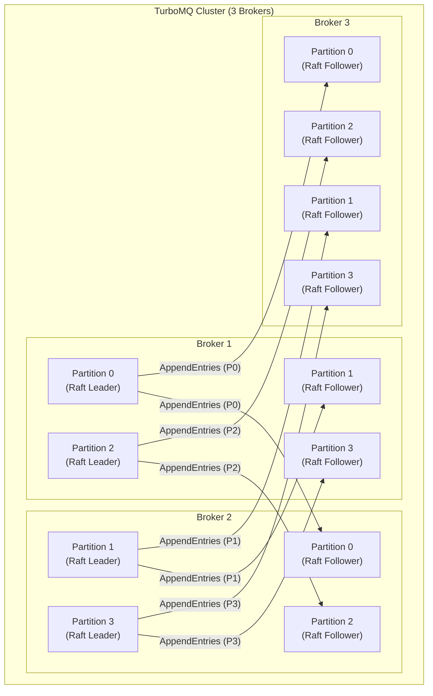
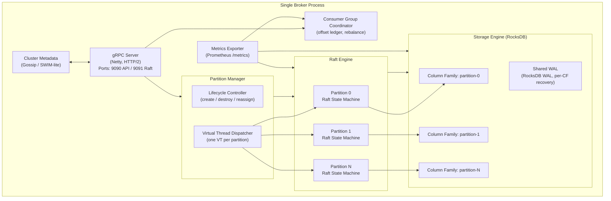
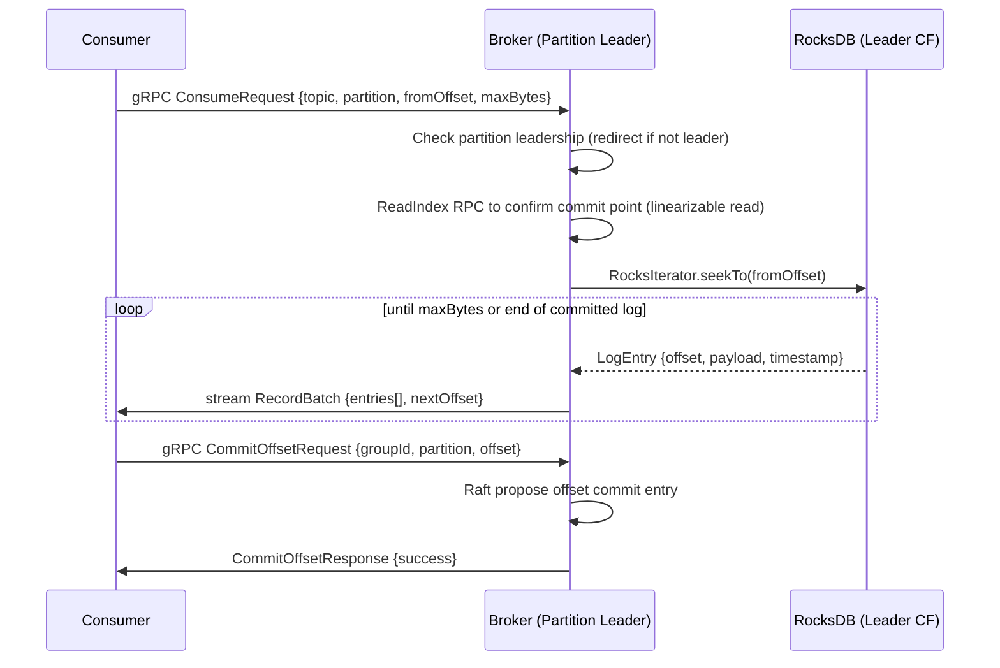
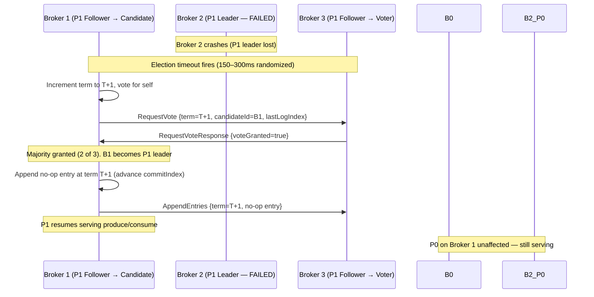
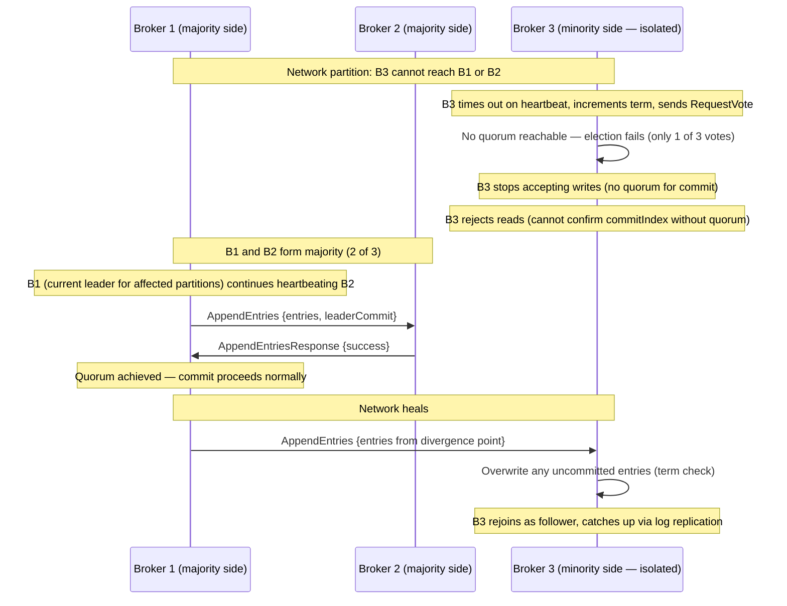
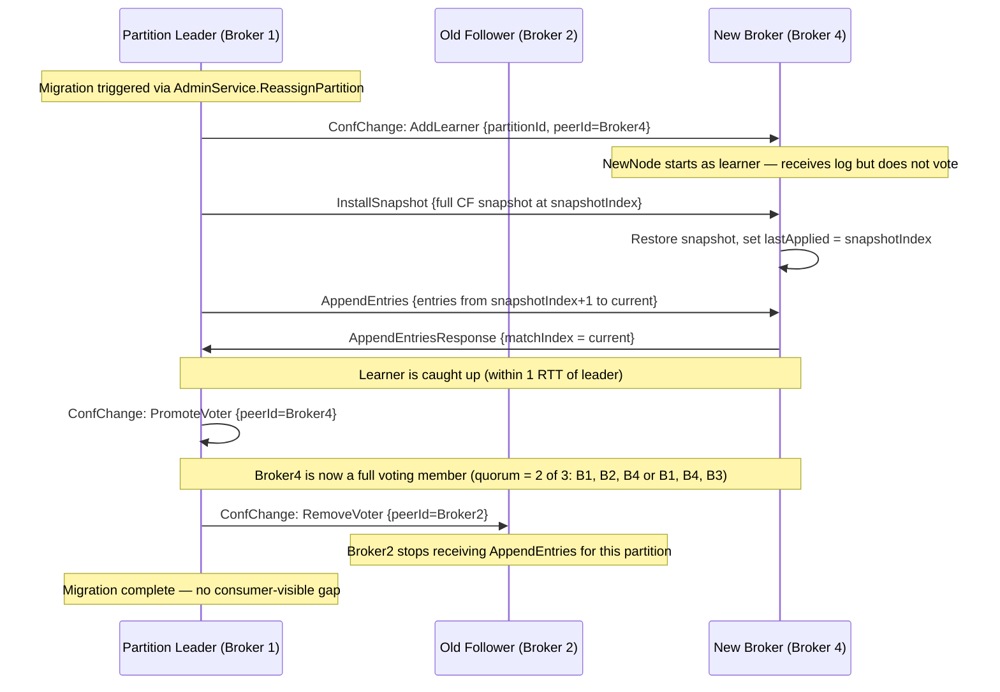
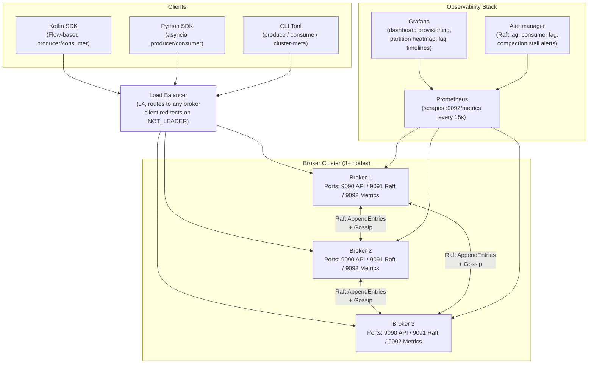

# TurboMQ — Architecture Deep Dive

> Per-partition Raft consensus. Zero-downtime migration. 50K+ msg/sec per node.

This document is the authoritative technical reference for TurboMQ's internal architecture. It covers the design philosophy, cluster topology, per-broker internals, core component contracts, data flow, failure handling, deployment model, and the design decisions that shaped the system.

---

## Table of Contents

1. [Design Philosophy](#1-design-philosophy)
2. [Cluster Topology](#2-cluster-topology)
3. [Single Broker Internals](#3-single-broker-internals)
4. [Core Components](#4-core-components)
5. [Data Flow](#5-data-flow)
6. [Failure Scenarios](#6-failure-scenarios)
7. [Deployment Architecture](#7-deployment-architecture)
8. [Design Decisions (ADR)](#8-design-decisions-adr)
9. [Integration Points](#9-integration-points)
10. [See Also](#10-see-also)

---

## 1. Design Philosophy

TurboMQ is built on three non-negotiable principles. Every component decision traces back to at least one of them.

### Principle 1 — Partition as the Unit of Everything

Consensus, storage, threading, and migration are all scoped to the partition. There is no cluster-wide leader, no global sequencer, and no shared coordination path. A partition is a self-contained universe: it owns its Raft group (term counter, log index, leader lease), its RocksDB column family, its virtual thread, and its `ConfChange` migration lifecycle.

This mirrors CockroachDB's per-range Raft model (described in their 2020 architecture docs and contextualized in *Designing Data-Intensive Applications* Ch. 9). The consequence is that the blast radius of any failure is bounded to the partitions whose Raft leader lived on the failed node. A 10,000-partition cluster losing one broker recovers ~N/cluster_size partitions, not all 10,000.

### Principle 2 — Simplicity Through Independence

There is no global controller process. No single node knows the authoritative state of all partitions — every broker gossips its own partition assignments and Raft peer membership. This eliminates the controller as a failure domain, removes the controller's metadata replay bottleneck on recovery, and simplifies the operational model: a broker is either in the cluster or it is not.

Kafka's KRaft controller consolidated ZooKeeper dependency but preserved the singleton controller failure domain. A controller crash in KRaft mode blocks all partition leader elections until a new controller is elected and replays the metadata log. TurboMQ has no such path: each partition's Raft group runs its own election with a configurable randomized timeout (150–300 ms by default), and recovery is concurrent across all affected partitions.

### Principle 3 — Modern JVM Primitives

Java 21 Virtual Threads (JEP 444, Project Loom) are not a performance hack — they are an architectural enabler. By parking a virtual thread on every blocking I/O call (RocksDB `writeBatch()`, gRPC stream flush, Raft `AppendEntries` network wait), TurboMQ achieves a simple, linear concurrency model: one virtual thread per partition. The JVM scheduler multiplexes thousands of virtual threads onto a small, fixed pool of carrier threads without programmer-visible thread management.

At 10,000 partitions, the virtual thread continuation stack consumes roughly 10 MB of heap — negligible against a typical 8–16 GB RocksDB block cache allocation. Platform threads at the same scale would require a 10,000-thread OS thread pool, introducing scheduler contention, context-switch overhead, and the operational burden of tuning pool sizes.

---

## 2. Cluster Topology

A TurboMQ cluster consists of N brokers (minimum 3 for fault tolerance). Each topic is divided into P partitions. Each partition is assigned to a Raft group of R replicas (typically 3). Raft groups are distributed across brokers so that leadership is spread evenly — no broker is the leader for all partitions simultaneously.



**Key observations:**

- Broker 1 is the Raft leader for P0 and P2; Broker 2 leads P1 and P3. Broker 3 carries only followers in this view. Under uniform distribution, leadership is spread ~N/cluster_size partitions per broker.
- Each partition's Raft group is entirely independent. P0's term counter, log index, and leader lease have zero causal relationship to P1's.
- A broker hosts both leader and follower roles simultaneously, consuming local RocksDB writes in both cases (leaders write on propose; followers write on `AppendEntries` apply).
- Clients resolve the current leader for a partition via the `ClusterMeta` gRPC RPC. The metadata is eventually consistent via gossip; clients retry on `NOT_LEADER` responses, which include the current leader address.

---

## 3. Single Broker Internals

Each broker is a single JVM process. All components share one RocksDB instance with per-partition column families and one gRPC server bound on two ports (API on `GRPC_PORT`, Raft peer communication on `RAFT_PORT`).



**Component interaction notes:**

- The gRPC Server receives `ProduceRequest`, `ConsumeRequest`, and `AdminRequest` RPCs, and routes them to the Partition Manager which resolves the local partition state machine.
- Each partition's Raft state machine runs in a dedicated virtual thread dispatched by the Virtual Thread Dispatcher. The dispatcher is a thin wrapper over `Thread.ofVirtual().start(...)` — there is no executor pool to tune.
- The Storage Engine is a thin adapter over `RocksDB.open()` with a pre-configured `ColumnFamilyDescriptor` per partition. All writes go through `WriteBatch` for atomicity; reads use a `RocksIterator` per consumer fetch.
- The Gossip subsystem maintains a peer membership table. On startup, each broker announces itself with its partition assignment map. Changes propagate via a push-pull gossip cycle with a configurable fanout (default: 3 peers, 500 ms interval).
- The Metrics Exporter exposes a `/metrics` HTTP endpoint (Prometheus text format) with per-partition gauges and histograms scraped directly from Raft state machine fields and RocksDB statistics.

---

## 4. Core Components

### 4.1 Broker

**Responsibility:** Node runtime. Initializes and owns all subsystems. Handles broker lifecycle (startup, graceful shutdown, crash recovery).

**Key interface:**

```kotlin
class Broker(config: BrokerConfig) {
    fun start()   // binds gRPC ports, opens RocksDB, starts gossip, loads partitions
    fun stop()    // drains in-flight RPCs, flushes WAL, closes column families
    fun assignPartition(partitionId: Int, peers: List<PeerAddress>)
    fun removePartition(partitionId: Int)
}
```

**Failure behavior:** On JVM crash, RocksDB's WAL provides crash recovery for all column families. The Raft log is stored in the partition's column family; on restart, each Raft state machine replays committed entries from its last applied index (`lastApplied` is persisted as a metadata key in the same CF). There is no global recovery coordinator — each partition recovers independently.

---

### 4.2 Partition Manager

**Responsibility:** Creates and destroys partition state machines on this broker. Handles reassignment signals from gossip (new peer joins, `ConfChange` migration). Tracks which partitions this broker leads versus follows.

**Key interface:**

```kotlin
interface PartitionManager {
    fun createPartition(id: Int, raftPeers: List<PeerAddress>): PartitionStateMachine
    fun destroyPartition(id: Int)
    fun getLeaderPartitions(): List<Int>
    fun applyConfChange(partitionId: Int, change: ConfChange)
}
```

**Failure behavior:** If partition creation fails (e.g., RocksDB column family already exists from a previous crashed incarnation), the manager detects the existing CF and resumes from the persisted Raft state rather than initializing fresh. Duplicate assignment messages are idempotent.

---

### 4.3 Raft Engine

**Responsibility:** Runs one independent Raft group per partition. Manages leader election (randomized election timeout, `RequestVote` RPC), log replication (`AppendEntries` RPC), and log compaction (snapshot install via `InstallSnapshot` RPC). Exposes a `propose()` API for the produce path and a `readCommitted()` API for the consume path.

**Key interface:**

```kotlin
interface RaftStateMachine {
    // Propose a command; suspends until committed (majority ACK) or throws on timeout/not-leader
    suspend fun propose(entry: LogEntry): CommitResult

    // Read the committed log at or after a given index (linearizable read via read-index protocol)
    suspend fun readCommitted(fromIndex: Long, maxEntries: Int): List<LogEntry>

    // Current term and leader hint for client redirect
    fun leaderInfo(): LeaderInfo

    // Membership change: add learner, promote to voter, remove voter
    suspend fun applyConfChange(change: ConfChange)
}
```

**Failure behavior:** On leader failure, remaining peers detect the missed heartbeat after `electionTimeoutMs` (150–300 ms randomized). A candidate increments its term, votes for itself, and broadcasts `RequestVote`. With a 3-replica group, a new leader is elected as soon as one additional peer grants its vote (majority = 2 of 3). The new leader's first action is appending a no-op entry to advance the commit index and flush any uncommitted entries from the previous term — preventing stale reads. Followers that miss `AppendEntries` due to network partition receive a `leaderCommit` correction on reconnect; if they are too far behind, the leader sends an `InstallSnapshot` with the full column family snapshot.

---

### 4.4 Storage Engine

**Responsibility:** Wraps `org.rocksdb.RocksDB` with a per-partition column family model. Provides `append()` for Raft log entries, `readRange()` for consumer fetches, `applyBatch()` for committed entry state machine application, and TTL-based compaction via a custom `CompactionFilter`.

**Key interface:**

```kotlin
interface PartitionStorage {
    fun append(batch: WriteBatch)          // Raft log append (leader + follower)
    fun applyBatch(entries: List<LogEntry>) // State machine apply after commit
    fun readRange(fromOffset: Long, maxBytes: Int): RecordBatch
    fun truncateSuffix(fromIndex: Long)    // Used during Raft leader conflict resolution
    fun snapshot(): RocksDBSnapshot        // For InstallSnapshot
    fun restoreSnapshot(snapshot: RocksDBSnapshot)
}
```

**Compaction configuration:**

```kotlin
val options = Options().apply {
    setWriteBufferSize(128 * 1024 * 1024)          // 128 MB memtable
    setMaxWriteBufferNumber(3)
    setLevel0FileNumCompactionTrigger(4)
    setTargetFileSizeBase(64 * 1024 * 1024)        // 64 MB SST files
    setCompactionStyle(CompactionStyle.LEVEL)
    setCompressionType(CompressionType.LZ4_COMPRESSION)
    setCompactionFilter(TtlCompactionFilter(retentionMs))
}
```

The `TtlCompactionFilter` inspects each key's embedded timestamp at compaction time and drops entries older than `retentionMs`. This avoids scan-time filtering overhead and keeps read latency flat as topics age.

**Failure behavior:** RocksDB's WAL ensures that any `WriteBatch` acknowledged to the Raft state machine is durable on crash. On restart, the storage engine calls `RocksDB.open()` with `setWalRecoveryMode(WALRecoveryMode.TolerateCorruptedTailRecords)` to handle partial writes from unclean shutdown. The Raft layer's persisted `lastApplied` index is used to skip re-applying already-applied entries.

---

### 4.5 gRPC API Layer

**Responsibility:** Exposes three Protocol Buffer v3 services. Routes incoming RPCs to the correct local partition or returns a `NOT_LEADER` status with a redirect hint if the partition's leader is on another broker.

**Services:**

| Service | RPCs | Transport |
|---|---|---|
| `ProducerService` | `Produce(ProduceRequest) -> ProduceResponse` | Unary + client-streaming batch |
| `ConsumerService` | `Consume(ConsumeRequest) -> stream RecordBatch` | Server-streaming |
| `AdminService` | `ClusterMeta`, `CreateTopic`, `DeleteTopic`, `ReassignPartition` | Unary |

**Key interface (proto excerpt):**

```protobuf
service ProducerService {
  rpc Produce(ProduceRequest) returns (ProduceResponse);
  rpc ProduceBatch(stream ProduceRequest) returns (ProduceResponse);
}

service ConsumerService {
  rpc Consume(ConsumeRequest) returns (stream RecordBatch);
  rpc CommitOffset(CommitOffsetRequest) returns (CommitOffsetResponse);
}
```

**Failure behavior:** On `NOT_LEADER`, the gRPC interceptor populates a `leader_hint` metadata field with the current leader's address from the local gossip table. The SDK retries against the hinted leader with exponential backoff. If no hint is available (election in progress), the client retries after `retryBaseMs` (default: 50 ms) up to `maxRetries` (default: 10).

---

### 4.6 Consumer Group Coordinator

**Responsibility:** Manages consumer group membership, partition assignment (via a configurable `AssignmentStrategy` — range or round-robin), and offset commit/fetch. Offset state is stored as Raft log entries in a dedicated internal partition (`__offsets`), providing linearizable offset reads without a separate coordination topic.

**Key interface:**

```kotlin
interface ConsumerGroupCoordinator {
    suspend fun joinGroup(groupId: String, memberId: String, topics: List<String>): GroupAssignment
    suspend fun heartbeat(groupId: String, memberId: String): HeartbeatResult
    suspend fun commitOffset(groupId: String, offsets: Map<TopicPartition, Long>)
    suspend fun fetchOffset(groupId: String, partitions: List<TopicPartition>): Map<TopicPartition, Long>
    suspend fun leaveGroup(groupId: String, memberId: String)
}
```

**Failure behavior:** Consumer failure is detected by missed heartbeats within `sessionTimeoutMs` (default: 30 s). The coordinator triggers a rebalance: all active members in the group receive a `REBALANCE_IN_PROGRESS` response on their next heartbeat and must re-`joinGroup`. The rebalance completes when all active members have submitted their `SyncGroup` requests. Offset commits are Raft-replicated entries; a failed commit is retried by the SDK until acknowledged.

---

## 5. Data Flow

### 5.1 Produce Path

```mermaid
sequenceDiagram
    participant Producer
    participant BrokerLeader as Broker (Partition Leader)
    participant Follower1 as Broker (Follower 1)
    participant Follower2 as Broker (Follower 2)
    participant RocksDB as RocksDB (Leader CF)

    Producer->>BrokerLeader: gRPC ProduceRequest {topic, partition, records}
    BrokerLeader->>BrokerLeader: Validate request, assign log index N
    BrokerLeader->>BrokerLeader: Append to Raft log (in-memory + WAL)
    par Replicate to quorum
        BrokerLeader->>Follower1: AppendEntries {term, leaderCommit, entries[N]}
        BrokerLeader->>Follower2: AppendEntries {term, leaderCommit, entries[N]}
    end
    Follower1->>BrokerLeader: AppendEntriesResponse {success, matchIndex=N}
    Note over BrokerLeader: Majority ACK received (2 of 3)
    BrokerLeader->>BrokerLeader: Advance commitIndex to N
    BrokerLeader->>RocksDB: WriteBatch.apply (committed entries up to N)
    RocksDB-->>BrokerLeader: Write acknowledged
    BrokerLeader->>Producer: ProduceResponse {offset=N, timestamp}
    Follower2->>BrokerLeader: AppendEntriesResponse {success, matchIndex=N}
    Note over Follower2: Follower applies async; does not block producer response
```

**Latency breakdown (P99 < 5 ms):**
- gRPC decode + routing: ~0.1 ms
- Raft propose + WAL append: ~0.3 ms
- Network RTT to quorum (same DC): ~0.5–1 ms
- Majority ACK + commitIndex advance: ~0.1 ms
- RocksDB `WriteBatch` apply: ~0.5–1.5 ms
- gRPC encode + response: ~0.1 ms

The dominant term is network RTT to the first follower to respond. On same-rack deployments, P99 drops below 2 ms.

---

### 5.2 Consume Path



**Notes:**
- The ReadIndex protocol (Raft §6.4) ensures the leader's commit index is up-to-date before serving reads, preventing stale reads during leader transitions.
- RocksDB iterator reads are zero-copy into the gRPC `ByteString` buffer when using `setUnsafeRelaxedAtomicsForTesting(false)` and direct byte buffer allocation.
- Server-streaming allows the broker to push batches as they become available without waiting for a full `maxBytes` fill, reducing tail latency for sparse partitions.

---

## 6. Failure Scenarios

### 6.1 Broker Failure

When Broker 2 fails, only the partitions whose Raft leader was on Broker 2 are disrupted. All other partitions continue serving reads and writes without interruption.



**Recovery timeline:**
- Heartbeat miss detection: `heartbeatTimeoutMs` (default: 50 ms × 2 = 100 ms)
- Election timeout: 150–300 ms (randomized per partition to avoid split votes)
- No-op commit + leader confirmation: ~1 network RTT
- Total: **< 500 ms to new leader serving**

The key property: only P1 (and any other partitions led by Broker 2) paused. The cluster's other 9,999 partitions were never aware of the failure.

---

### 6.2 Network Partition



**Guarantee:** The majority partition (B1+B2) never diverges — all committed entries have been acknowledged by 2 of 3 nodes. B3's uncommitted entries (if any were proposed during its isolated term increment) are overwritten when the higher-term leader reconnects. This is standard Raft safety: a committed entry is always present in the log of any future leader.

---

### 6.3 Partition Migration (Zero-Downtime ConfChange)



**Properties:**
- Producers and consumers interact only with the Raft leader throughout. The leader's commit index advances uninterrupted during learner catch-up.
- The quorum size never drops below majority: `PromoteVoter` is applied before `RemoveVoter`, so the group transiently has 4 members (quorum = 3) during the crossover window.
- If the new node falls too far behind (network degraded), the migration is aborted via a `ConfChange: RemoveLearner` and can be retried. No committed data is lost.

---

## 7. Deployment Architecture



**Deployment notes:**
- The load balancer is stateless (L4 TCP passthrough). Clients resolve partition leaders via `ClusterMeta` RPC on any broker and subsequently connect directly to the leader for produce/consume. The LB is only in the bootstrap path.
- For Kubernetes deployments, each broker is a `StatefulSet` pod with a `PersistentVolumeClaim` for RocksDB data. The Raft port (`9091`) must be accessible pod-to-pod without NAT (host networking or a pod-to-pod routable overlay like Cilium).
- Prometheus scrapes are configured with `scrape_interval: 15s` and `scrape_timeout: 10s`. Per-partition metrics cardinality scales as O(partitions × brokers); at 1,000 partitions across 3 brokers, expect ~15K time series.

---

## 8. Design Decisions (ADR)

| Decision | Context | Choice | Consequences | Book Reference |
|---|---|---|---|---|
| **Per-partition Raft** | Kafka's single KRaft controller is a SPOF: controller failure blocks all partition leader elections cluster-wide until metadata log replay completes | Run one independent Raft group per partition; no global controller | Fault isolation: broker failure affects only its partitions; recovery is concurrent; downside: N×Raft groups increase network message count (O(partitions × replicas) heartbeats/sec) | *DDIA* Ch. 9 (Consistency and Consensus); *Designing Distributed Systems* Ch. 4 (Replicated Services) |
| **RocksDB storage** | Message queues require high write throughput with sequential append-dominant workloads; B-Tree engines (InnoDB) suffer write amplification under such patterns | LSM-tree via RocksDB with per-partition column families; tiered compaction; TTL `CompactionFilter` | Write throughput of 50K+ msg/sec on NVMe; LSM write amplification is a known cost (mitigated by large memtables and LZ4 compression); read amplification bounded by level count (default: 7 levels) | *DDIA* Ch. 3 (Storage and Retrieval, LSM-Trees vs. B-Trees); *Database Internals* Ch. 7 (Log-Structured Storage) |
| **Virtual-thread-per-partition** | At 10,000 partitions, a platform-thread-per-partition model requires 10K OS threads with unacceptable scheduler contention; thread pool models require operational tuning of pool sizes, queue depths, and rejection policies | Java 21 Virtual Threads (JEP 444): one virtual thread per partition, parked on every blocking I/O call | Simple, linear concurrency model; ~1 KB heap per virtual thread at rest → 10 MB for 10K partitions; risk: virtual thread pinning on synchronized blocks within RocksDB JNI calls (mitigated by `jdk.tracePinnedThreads` detection and wrapping JNI calls with `ReentrantLock`) | JEP 444 (Project Loom); N/A in listed books |
| **gRPC over custom binary protocol** | Custom protocols (Kafka Wire Protocol) require bespoke client libraries for each language; HTTP/2 multiplexing and Protocol Buffers provide standard tooling, code generation, and schema evolution | gRPC with HTTP/2 and proto3; server-streaming for consume path; client-streaming for batch produce | Standard codegen for Kotlin and Python SDKs; HTTP/2 multiplexing eliminates head-of-line blocking per connection; slight overhead vs. custom zero-copy protocol (~5% CPU for proto encode/decode at peak throughput) | *Building Microservices* Ch. 4 (Communication Styles) |
| **CockroachDB-inspired per-range Raft** | Independent partition management with zero-downtime migration requires a mechanism to change Raft group membership without global coordination; Kafka's ISR-based reassignment pauses replication during ISR shrinkage | Per-range Raft adapted for message queue semantics: `ConfChange` AddLearner → catch-up → PromoteVoter → RemoveVoter pipeline | Zero-downtime partition migration with no consumer-visible gap; quorum size transiently increases during crossover; Raft group complexity increases (snapshot install, log truncation on conflict) must be implemented correctly | *DDIA* Ch. 9 (Membership and Coordination Services); CockroachDB architecture docs (per-range Raft) |

---

## 9. Integration Points

### NexusDB — Offset Storage Backend (Optional)

TurboMQ's default offset storage is an internal Raft-replicated partition (`__offsets`). For deployments requiring cross-cluster offset synchronization or long-term offset history, NexusDB can replace the internal offset store. NexusDB's MVCC transaction model provides serializable offset reads, eliminating the read-your-writes anomaly that can occur if the `__offsets` leader is in the middle of an election.

Integration path: implement `OffsetStore` interface backed by NexusDB's JDBC driver. NexusDB's adaptive lock elision (described in its architecture) handles the hot-key contention pattern inherent to consumer group offset commits (many consumers converging on a small set of group/partition keys).

See: [`../../nexus-db/README.md`](../../nexus-db/README.md)

### AgentForge — Coordination Pattern Reference

AgentForge's speculative execution model shares a structural analogy with TurboMQ's Raft pipeline: both systems must decide when to commit the result of an optimistic action (a proposed Raft entry, a speculatively started agent task) and how to roll back on mismatch. AgentForge's `RollbackCoordinator` design — specifically its use of idempotency keys to make rollback safe under partial failure — informed TurboMQ's idempotent producer ID scheme.

AgentForge also uses a message queue for agent task dispatch. In production deployments, TurboMQ serves as that queue, replacing the Apache Kafka dependency shown in AgentForge's tech stack badges.

See: [`../../agent-forge/README.md`](../../agent-forge/README.md)

---

## 10. See Also

| Document | Description |
|---|---|
| [`../README.md`](../README.md) | Project overview, quick start, performance benchmarks, TurboMQ vs Kafka comparison |
| [`raft-consensus.md`](raft-consensus.md) | Per-partition Raft deep dive, leader election, log replication, zero-downtime migration |
| [`storage-engine.md`](storage-engine.md) | RocksDB integration, LSM-tree structure, write/read paths, compaction strategy, Raft snapshotting |
| [`virtual-threads.md`](virtual-threads.md) | Virtual-thread-per-partition architecture, scheduling, scalability analysis, pinning avoidance |
| [`api-and-sdks.md`](api-and-sdks.md) | gRPC API definitions, delivery guarantees, consumer groups, Kotlin/Python SDKs, Grafana dashboard |
