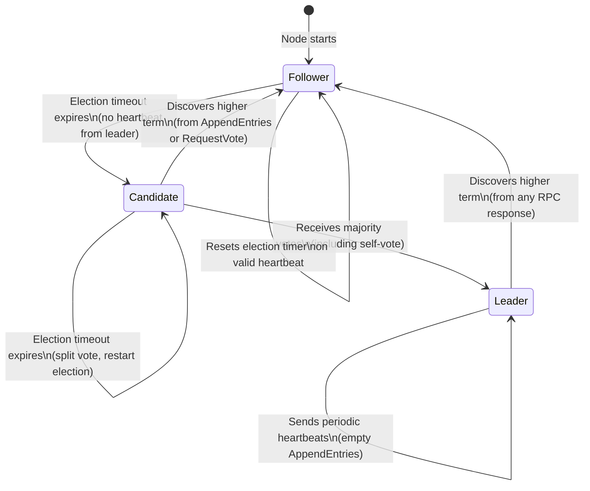
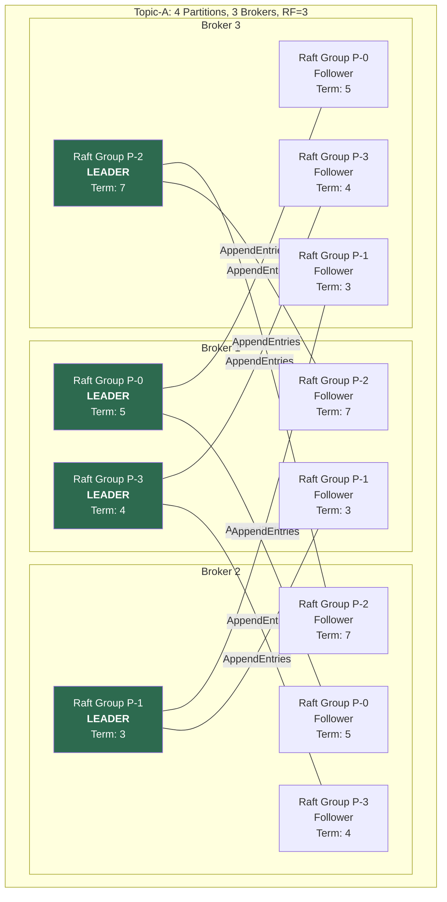
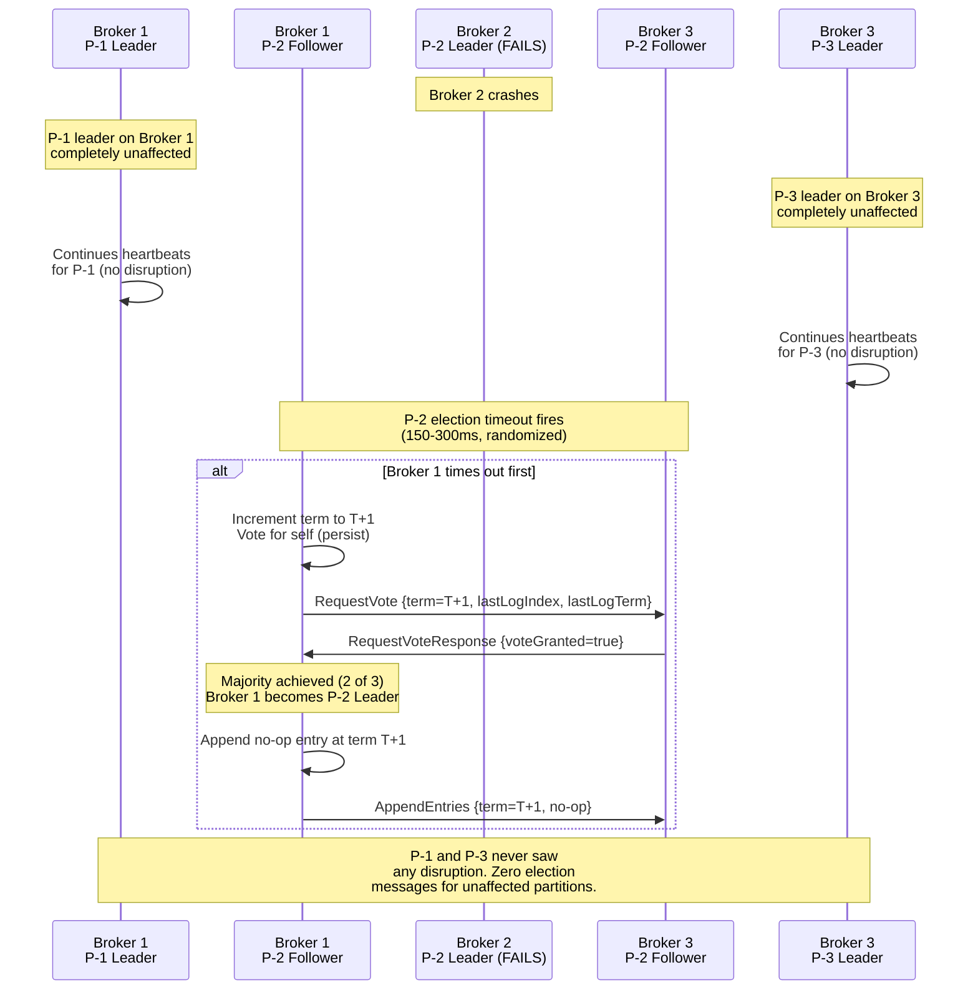
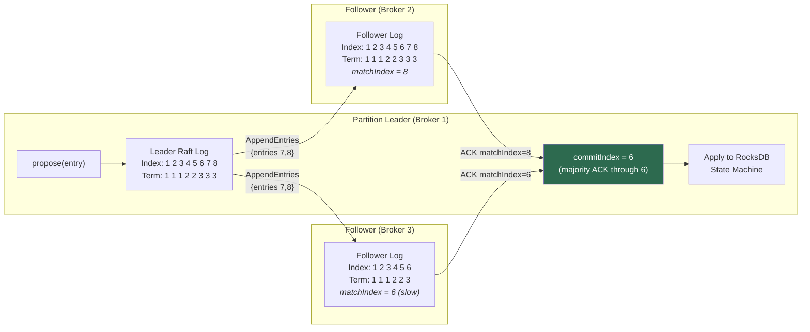
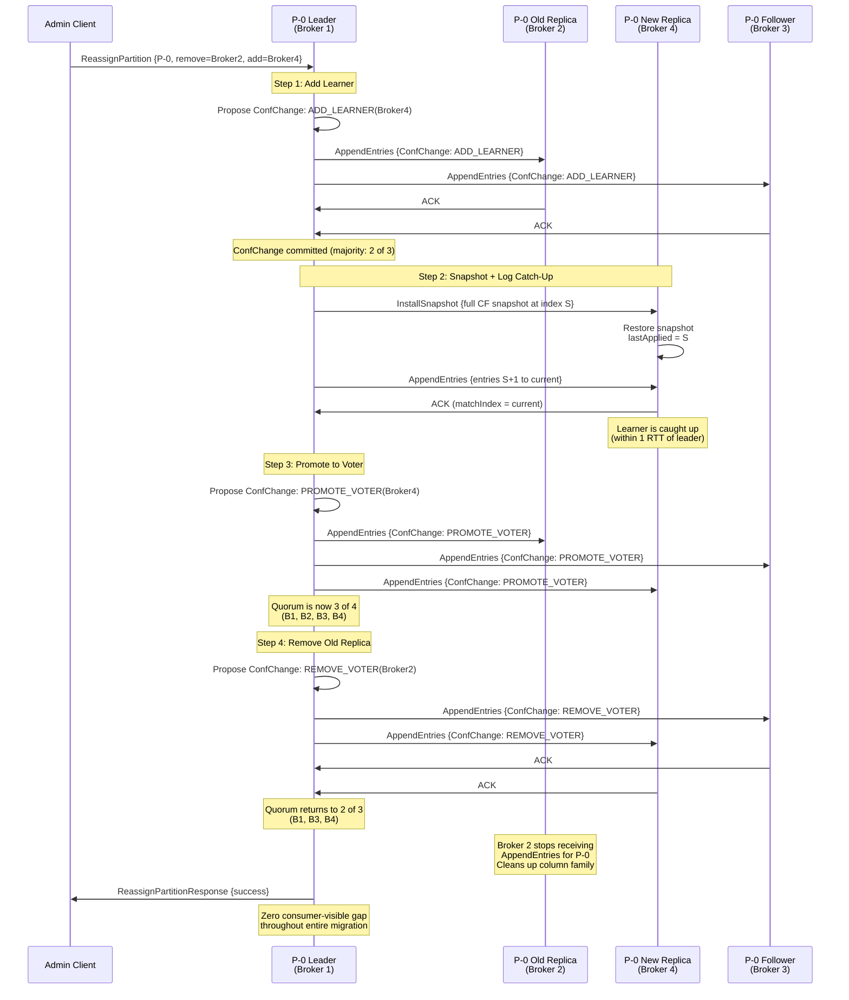
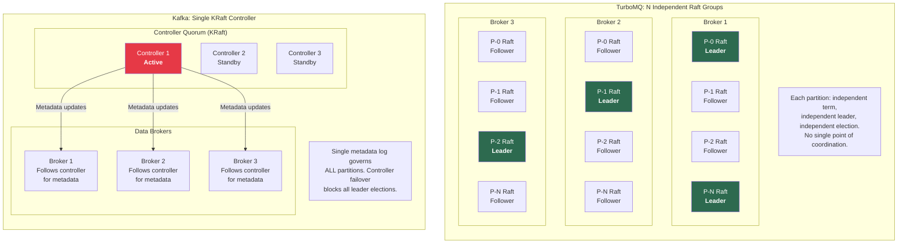

# TurboMQ — Per-Partition Raft Consensus

> Fault isolation at partition granularity. Independent leader election. Zero-downtime migration. 10K+ partitions per broker.

This document is the authoritative technical reference for TurboMQ's consensus layer. It covers the motivation for per-partition Raft, the Raft protocol fundamentals, the per-partition architecture, leader election mechanics, log replication pipeline, zero-downtime partition migration, a rigorous comparison against Kafka's KRaft, and the full configuration surface. Every design decision traces to a correctness property or a fault-isolation guarantee absent from centralized-controller architectures.

---

## Table of Contents

1. [Why Per-Partition Raft?](#1-why-per-partition-raft)
2. [Raft Fundamentals](#2-raft-fundamentals)
3. [Per-Partition Raft Architecture](#3-per-partition-raft-architecture)
4. [Leader Election Deep Dive](#4-leader-election-deep-dive)
5. [Log Replication](#5-log-replication)
6. [Partition Migration (Zero-Downtime)](#6-partition-migration-zero-downtime)
7. [Comparison: Per-Partition Raft vs Kafka KRaft](#7-comparison-per-partition-raft-vs-kafka-kraft)
8. [Configuration Reference](#8-configuration-reference)

---

## 1. Why Per-Partition Raft?

### The Problem with Centralized Controllers

Apache Kafka's transition from ZooKeeper to KRaft (KIP-500) consolidated metadata management into a single Raft-based controller quorum. This eliminated the external ZooKeeper dependency but preserved a fundamental architectural constraint: **a single controller quorum governs the entire cluster's metadata**. When the active KRaft controller fails, the consequences are cluster-wide:

1. **Election stall.** All partition leader elections are blocked until a new controller is elected and finishes replaying the metadata log. For a cluster with 200K partitions, metadata replay alone can take 10-30 seconds.
2. **Correlated failure.** A controller bug, OOM, or GC pause affects every topic in the cluster simultaneously. There is no fault boundary between partitions.
3. **Metadata bottleneck.** Every partition state change (leader election, ISR update, reassignment) serializes through a single metadata log. At high partition counts, this log becomes a throughput ceiling.
4. **Operational blast radius.** A misconfigured controller rolling restart ripples across the entire cluster, not a subset of partitions.

This is not a Kafka-specific problem. It is the inherent consequence of centralized consensus for distributed metadata. As Kleppmann observes in *Designing Data-Intensive Applications* Ch. 9 ("Limitations of Consensus"):

> "Most consensus algorithms assume a fixed set of nodes that participate in voting, which means that you can't just add or remove nodes in the cluster. [...] Consensus algorithms are particularly sensitive to network problems."

The centralized controller model amplifies this sensitivity: network problems between the controller and any broker affect all partitions on that broker, regardless of whether those partitions' data replicas are healthy.

### The Inspiration: CockroachDB's Per-Range Raft

CockroachDB solved the analogous problem in the database domain. Rather than running a single Raft group for the entire database, CockroachDB partitions its keyspace into ranges, each backed by its own independent Raft group. A range's election, log replication, and membership changes are invisible to every other range. This design is described in their architecture documentation and contextualized in *DDIA* Ch. 6 ("Partitioning and Replication"):

> "Each partition can be thought of as a small database in its own right."

TurboMQ applies this principle to message queue semantics: **each partition is an independent Raft group**. The partition is not merely the unit of data sharding -- it is the unit of consensus, failure isolation, leader election, log replication, and membership change. There is no global controller, no cluster-wide metadata log, and no single point of coordination.

### The Result: Partition-Granularity Fault Isolation

The consequences of this design are measurable:

- **Failure blast radius:** When a broker crashes, only the partitions whose Raft leader resided on that broker are disrupted. A 10,000-partition cluster losing one of three brokers recovers ~3,333 partitions concurrently; the remaining ~6,667 partitions never observe the failure.
- **Election concurrency:** All affected partitions run independent elections simultaneously with randomized timeouts (150-300 ms). There is no serial replay bottleneck. Total recovery to full leadership coverage is under 500 ms.
- **Metadata scalability:** Partition metadata (term, votedFor, commitIndex, Raft log) is stored locally in each partition's RocksDB column family. There is no centralized metadata log to replay. The system scales to 10K+ partitions per broker without metadata throughput ceilings.
- **Operational independence:** A Raft configuration change (adding a learner, promoting a voter, removing a replica) on one partition has zero causal relationship to any other partition's state.

---

## 2. Raft Fundamentals

Raft (Ongaro & Ousterhout, 2014) is a consensus algorithm designed for understandability. TurboMQ implements the full Raft specification with extensions for pre-vote (dissertation section 9.6) and joint consensus membership changes.

### State Machine

Every node in a Raft group is in exactly one of three states at any moment:



### Key Properties

| Property | Guarantee |
|---|---|
| **Election safety** | At most one leader per term. Enforced by requiring majority vote and restricting each node to one vote per term. |
| **Leader append-only** | A leader never overwrites or deletes entries in its log; it only appends new entries. |
| **Log matching** | If two logs contain an entry with the same index and term, then the logs are identical in all entries up through that index. |
| **Leader completeness** | If a log entry is committed in a given term, that entry is present in the logs of all leaders for all higher terms. |
| **State machine safety** | If a server has applied a log entry at a given index to its state machine, no other server will ever apply a different entry for that same index. |

These properties, combined, guarantee **linearizable writes**: once a client receives an acknowledgment for a proposed entry, that entry is durably committed and will appear in the applied state of every current and future leader.

### Message Types

TurboMQ's Raft implementation models all inter-node messages as a sealed class hierarchy, enabling exhaustive `when` matching and compile-time safety:

```kotlin
/**
 * Raft protocol messages. Each partition's Raft group exchanges these
 * messages independently — there is no shared message bus across partitions.
 */
sealed class RaftMessage {
    abstract val term: Long
    abstract val partitionId: Int

    /**
     * Sent by leader to replicate log entries and serve as heartbeat.
     * An empty entries list functions as a heartbeat.
     */
    data class AppendEntries(
        override val term: Long,
        override val partitionId: Int,
        val leaderId: Int,
        val prevLogIndex: Long,
        val prevLogTerm: Long,
        val entries: List<LogEntry>,
        val leaderCommit: Long
    ) : RaftMessage()

    data class AppendEntriesResponse(
        override val term: Long,
        override val partitionId: Int,
        val success: Boolean,
        val matchIndex: Long,
        val conflictIndex: Long?,
        val conflictTerm: Long?
    ) : RaftMessage()

    /**
     * Sent by candidate to request votes during leader election.
     * Includes lastLogIndex/lastLogTerm for the up-to-date check.
     */
    data class RequestVote(
        override val term: Long,
        override val partitionId: Int,
        val candidateId: Int,
        val lastLogIndex: Long,
        val lastLogTerm: Long
    ) : RaftMessage()

    data class RequestVoteResponse(
        override val term: Long,
        override val partitionId: Int,
        val voteGranted: Boolean
    ) : RaftMessage()

    /**
     * Sent by leader when a follower's log is too far behind for
     * incremental AppendEntries. Transfers a full RocksDB snapshot.
     */
    data class InstallSnapshot(
        override val term: Long,
        override val partitionId: Int,
        val leaderId: Int,
        val lastIncludedIndex: Long,
        val lastIncludedTerm: Long,
        val offset: Long,
        val data: ByteArray,
        val done: Boolean
    ) : RaftMessage()

    /**
     * Membership change: add learner, promote voter, remove voter.
     * Processed through Raft log for linearizable membership transitions.
     */
    data class ConfChange(
        override val term: Long,
        override val partitionId: Int,
        val changeType: ConfChangeType,
        val peerId: Int,
        val peerAddress: String
    ) : RaftMessage()
}

enum class ConfChangeType {
    ADD_LEARNER,
    PROMOTE_VOTER,
    REMOVE_VOTER
}
```

Every message carries a `partitionId` field. When a broker receives a Raft message over gRPC, the Raft router demultiplexes by `partitionId` and dispatches to the correct partition's virtual thread. Messages for different partitions share the same gRPC connection (HTTP/2 multiplexing) but are processed by independent state machines with independent term counters.

---

## 3. Per-Partition Raft Architecture

### Partition-to-Raft-Group Mapping

The mapping is 1:1 and immutable for the lifetime of a partition:

- **One partition = one Raft group.** Partition 0 has its own term counter, its own voted-for record, its own log, and its own leader. Partition 1 has entirely separate instances of all of these.
- **No shared state.** There is no global term, no global leader, and no global log. Two partitions on the same broker share a RocksDB instance (for operational simplicity) but use separate column families with separate WAL sequences.
- **Independent lifecycles.** Partition 0 can be undergoing a `ConfChange` migration while Partition 1 is in steady-state replication and Partition 2 is electing a new leader. These operations are causally independent.

### Multi-Group Architecture Diagram

The following diagram illustrates Topic-A with 4 partitions distributed across 3 brokers. Note how leadership is naturally balanced -- no single broker is the leader for all partitions:



**Key observations:**

- **Natural load balancing.** P-0 leader is on Broker 1, P-1 leader on Broker 2, P-2 leader on Broker 3, P-3 leader on Broker 1. Leadership distributes organically through randomized election timeouts. No "preferred replica election" mechanism is needed -- the Raft protocol's randomized timeout naturally spreads leadership across brokers.
- **Independent terms.** P-0 is on term 5 while P-2 is on term 7. Each partition's term reflects its own election history. A partition that has experienced more leader changes has a higher term; this has no bearing on other partitions.
- **Broker 3 leads only P-2.** This is a valid steady state. If Broker 3 is under-loaded, new partitions can be placed there. If Broker 3 fails, only P-2's leadership is disrupted; P-0, P-1, and P-3 continue uninterrupted.
- **Cross-broker Raft traffic.** Each leader sends `AppendEntries` to its two followers. The total Raft message rate is `2 * P * heartbeat_rate` for heartbeats plus `2 * P * write_rate` for log replication. At 10,000 partitions and 20 heartbeats/sec, baseline heartbeat traffic is 400K messages/sec -- well within gRPC/HTTP2 multiplexing capacity over a 10 GbE link.

**Reference:** CockroachDB architecture documentation (per-range Raft design); *DDIA* Ch. 6, "Partitioning and Replication":

> "The main reason for wanting to partition data is scalability. [...] A large dataset can be distributed across many disks, and the query load can be distributed across many processors."

TurboMQ extends this principle from data to consensus: a large consensus workload can be distributed across many independent Raft groups, each with its own leader, its own throughput budget, and its own failure domain.

---

## 4. Leader Election Deep Dive

### Election Mechanics

A leader election is triggered when a follower's election timer expires without receiving a valid `AppendEntries` heartbeat from the current leader. The sequence:

1. **Timeout.** The follower has not received a heartbeat within `electionTimeoutMs` (randomized between 150-300 ms per partition to avoid synchronized elections).
2. **Term increment.** The follower increments its term to `T+1` and transitions to the Candidate state.
3. **Self-vote.** The candidate votes for itself and persists `(term=T+1, votedFor=self)` to its RocksDB column family before sending any network messages. This persistence is critical: if the candidate crashes and restarts, it must not vote for a different candidate in the same term.
4. **RequestVote broadcast.** The candidate sends `RequestVote` RPCs to all peers in the Raft group. The RPC includes `lastLogIndex` and `lastLogTerm` so voters can enforce the up-to-date check (Raft safety property: a candidate's log must be at least as up-to-date as the voter's log).
5. **Vote collection.** If the candidate receives votes from a majority of the group (including itself), it transitions to Leader and immediately sends heartbeats to assert authority.
6. **No-op entry.** The new leader appends a no-op entry at its current term and replicates it. This advances the commit index and ensures that any entries from prior terms that have achieved majority replication are now committed under the new leader's term.

### Fault-Isolated Election Sequence

The following diagram shows the critical property: when Broker 2 fails, only Partition-2 (whose leader was on Broker 2) triggers an election. Partition-1 and Partition-3, led by Broker 1 and Broker 3 respectively, are completely unaffected.



**Timeline (worst case to new leader serving):**

| Phase | Duration |
|---|---|
| Heartbeat miss detection | 100 ms (2 missed heartbeats at 50 ms interval) |
| Election timeout (randomized) | 150-300 ms |
| RequestVote RPC round-trip | < 1 ms (same datacenter) |
| No-op commit (1 RTT to majority) | < 1 ms |
| **Total** | **< 500 ms** |

In the Kafka KRaft model, the equivalent recovery requires: controller election (seconds) + metadata log replay (seconds to tens of seconds at high partition counts) + partition leader election orchestration (sequential per batch). TurboMQ's per-partition model eliminates the first two phases entirely.

### Pre-Vote Extension

A node that is network-partitioned from the leader will repeatedly time out and increment its term. When the network partition heals, this node has a term much higher than the current leader. Without mitigation, it would force a disruptive election by sending `RequestVote` with a high term, causing the healthy leader to step down.

TurboMQ implements the **Pre-Vote** extension (Raft dissertation, section 9.6):

1. Before incrementing its term, a candidate sends a `PreVote` RPC with its current term + 1 (hypothetical) and its log status.
2. Peers respond affirmatively only if they have not received a heartbeat from a valid leader within the election timeout AND the candidate's log is at least as up-to-date.
3. If the pre-vote fails (because the existing leader is healthy and peers recently received heartbeats), the candidate does not increment its term.
4. If the pre-vote succeeds (peers agree the leader may be dead), the candidate proceeds with a real election.

This prevents disruptive elections from nodes returning from network partitions. The configuration parameter `raft.pre-vote.enabled` defaults to `true`.

**Reference:** *DDIA* Ch. 9, "Leader and Followers," "Handling Node Outages":

> "Raft ensures that there is at most one leader per term. [...] If the follower hasn't received a message within the election timeout, it assumes the leader has failed."

---

## 5. Log Replication

### Replication Architecture

Every committed message in TurboMQ passes through the Raft log replication pipeline. The leader accepts proposed entries from the produce path, appends them to its local log, replicates to followers via `AppendEntries` RPCs, and commits once a majority has acknowledged.



**Observations:** Follower on Broker 2 is fully caught up (matchIndex = 8). Follower on Broker 3 has only acknowledged through index 6, making it a slow follower. The commitIndex is 6 because that is the highest index acknowledged by a majority (leader + Broker 2 = 2 of 3 for indices 7-8, but the commit requires only majority, so the leader can actually commit through 8 once Broker 2 ACKs). The leader applies committed entries to RocksDB asynchronously after advancing the commit index.

### Write Path Through Raft (6 Steps)

The complete write path for a single produce request:

| Step | Component | Action | Durability |
|---|---|---|---|
| 1. Receive | gRPC Server | Deserialize `ProduceRequest`, route to partition leader's virtual thread | None (in-flight) |
| 2. Append to leader log | Raft State Machine | Assign log index N, write entry to leader's WAL via `WriteBatch` | WAL-durable on leader |
| 3. Replicate | Raft State Machine | Send `AppendEntries {entries[N]}` to all followers concurrently | In-flight on network |
| 4. Majority ACK | Raft State Machine | Collect `AppendEntriesResponse` from at least one follower (leader + 1 follower = majority of 3) | WAL-durable on majority |
| 5. Commit | Raft State Machine | Advance `commitIndex` to N; entry is now committed and will never be rolled back | Committed (Raft guarantee) |
| 6. Apply | Storage Engine | Apply committed entries to RocksDB column family state machine; return `ProduceResponse` to client | State-machine-durable |

**Latency at each step (P99, same-datacenter, NVMe storage):**

- Step 1: ~0.1 ms (gRPC decode)
- Step 2: ~0.3 ms (WAL fsync, batched)
- Step 3-4: ~0.5-1.0 ms (network RTT to fastest follower)
- Step 5: ~0.01 ms (in-memory index advance)
- Step 6: ~0.5-1.5 ms (RocksDB WriteBatch)
- **Total P99: < 5 ms**

### Batching and Pipelining

TurboMQ optimizes Raft throughput through two complementary techniques:

**Entry batching.** Multiple produce requests that arrive within a configurable batching window (`raft.batch.interval-ms`, default: 1 ms) are coalesced into a single Raft log entry. A single `AppendEntries` RPC may carry hundreds of messages. This amortizes the per-RPC overhead (gRPC framing, TLS encryption, WAL fsync) across many messages. At 50K+ msg/sec per partition, batching reduces AppendEntries RPC rate from 50K/sec to ~1-5K/sec.

**Pipeline depth.** The leader does not wait for the previous `AppendEntries` to be acknowledged before sending the next one. The pipeline depth (`raft.pipeline.depth`, default: 4) controls how many in-flight `AppendEntries` RPCs are permitted per follower. With a pipeline depth of 4 and 1 ms network RTT, the leader can keep 4 batches in flight simultaneously, achieving ~4x throughput compared to stop-and-wait replication.

### Flow Control and Backpressure

Unbounded replication would overwhelm slow followers. TurboMQ implements three flow control mechanisms:

1. **Slow follower detection.** If a follower's `matchIndex` falls more than `raft.max-lag-entries` (default: 10,000) behind the leader's last log index, the leader transitions that follower to a "probe" state: it sends one AppendEntries at a time and waits for acknowledgment before sending the next. This prevents a slow follower from consuming unbounded leader-side memory for in-flight entries.

2. **Snapshot trigger threshold.** If a follower's lag exceeds `raft.snapshot.trigger-lag` (default: 100,000 entries), incremental log replication is abandoned. The leader initiates an `InstallSnapshot` transfer, sending a full RocksDB column family snapshot. After snapshot installation, the follower resumes normal log replication from the snapshot's last included index.

3. **Leader-side send buffer.** Each follower's replication stream has a bounded send buffer (`raft.send-buffer-size`, default: 64 MB). If the buffer fills (follower is not consuming ACKs), the leader applies backpressure to the produce path: `propose()` calls block until buffer space is available. This prevents OOM on the leader due to unbounded in-flight replication data.

**Reference:** *DDIA* Ch. 9, "Raft log replication":

> "The leader appends the command to its log as a new entry, then issues AppendEntries RPCs in parallel to each of the other servers to replicate the entry."

---

## 6. Partition Migration (Zero-Downtime)

### Motivation

Partition migration -- moving a partition's replica from one broker to another -- is required for:

- **Rebalancing.** Distributing partitions evenly after adding new brokers to the cluster.
- **Failed replica replacement.** Replacing a permanently lost broker's replicas on surviving or new brokers.
- **Rack-awareness.** Ensuring replicas span failure domains (racks, availability zones) after topology changes.
- **Capacity expansion.** Moving hot partitions off overloaded brokers.

### The ConfChange Pipeline

TurboMQ implements migration as a sequence of Raft `ConfChange` operations. The key insight is that membership changes are themselves Raft log entries, processed through the same consensus pipeline as data entries. This guarantees linearizability of membership changes with respect to data writes.



**Critical safety properties:**

- **Quorum never drops below majority.** `PROMOTE_VOTER` is applied before `REMOVE_VOTER`. During the crossover window, the group has 4 members (quorum = 3), which is strictly safer than the original 3-member group.
- **Learner does not vote.** During snapshot transfer and catch-up, the new node is a learner. It receives `AppendEntries` but does not participate in quorum decisions. This prevents a partially-caught-up node from affecting commit decisions.
- **Atomic per step, composable across steps.** Each `ConfChange` is a single Raft log entry that is committed through the normal consensus pipeline. If the leader crashes mid-migration, the new leader replays the committed ConfChanges and continues from the last completed step.
- **Rollback capability.** If the learner fails to catch up (e.g., network degradation to the new broker), the migration can be aborted by proposing a `REMOVE_VOTER` (if already promoted) or `REMOVE_LEARNER` ConfChange. No committed data is lost.

### Migration Comparison: TurboMQ vs Kafka

| Dimension | TurboMQ (Per-Partition Raft) | Kafka (ISR-based Reassignment) |
|---|---|---|
| **Mechanism** | Raft ConfChange pipeline: AddLearner, snapshot, catch-up, PromoteVoter, RemoveVoter | Controller-orchestrated ISR expansion: add new replica to assignment, wait for ISR catch-up, update preferred leader, remove old replica |
| **Availability during migration** | Full read/write availability. Leader continues serving throughout. Learner catch-up is invisible to clients. | Reduced write availability possible if ISR shrinks during reassignment. `min.insync.replicas` violation can block producers. |
| **Atomicity** | Each ConfChange step is a committed Raft entry. Crash recovery replays committed steps automatically. | Multi-step controller operation. Partial completion requires manual `kafka-reassign-partitions --verify` and potential manual cleanup. |
| **Rollback capability** | Propose reverse ConfChange (RemoveLearner or RemoveVoter). Takes effect within one Raft commit cycle (< 5 ms). | Cancel via `kafka-reassign-partitions --cancel`. May leave partition in intermediate state requiring controller intervention. |
| **Leader impact** | Leader is unaffected. No leader movement required. | May require preferred-replica-election after reassignment to restore leader balance. Brief unavailability during leader transfer. |
| **Data transfer** | RocksDB snapshot (streaming, compressed) + incremental log entries. Snapshot is a consistent point-in-time image. | Full partition data copy via Kafka replication protocol. No snapshot primitive; new replica replays from earliest available offset. |
| **Concurrency** | All partition migrations are independent. 100 simultaneous migrations have zero coordination overhead. | Controller throttles concurrent reassignments via `leader.replication.throttled.rate`. Global limit on reassignment bandwidth. |

**Reference:** *DDIA* Ch. 6, "Rebalancing Partitions":

> "All of these changes call for data and requests to be moved from one node to another. The process of moving load from one node in the cluster to another is called rebalancing."

*Building Resilient Distributed Systems* Ch. 5 discusses the importance of maintaining quorum safety during membership transitions, which TurboMQ achieves through the learner-promote-remove pipeline.

---

## 7. Comparison: Per-Partition Raft vs Kafka KRaft

### Architectural Comparison

The fundamental difference is the scope of consensus. TurboMQ runs N independent Raft groups (one per partition). Kafka runs a single Raft group for cluster-wide metadata, with a separate ISR-based replication protocol for partition data.



### Detailed Comparison

| Dimension | TurboMQ (Per-Partition Raft) | Kafka KRaft |
|---|---|---|
| **Unit of consensus** | Per partition. Each partition is an independent Raft group with its own term, leader, and log. | Cluster-wide metadata. A single Raft group manages the metadata log that describes all partitions. Data replication uses a separate ISR protocol, not Raft. |
| **Election scope** | Single partition. An election involves only the 3 (or RF) nodes hosting that partition's replicas. | Entire controller quorum. A controller election involves all controller nodes and blocks all metadata operations. |
| **Failure blast radius** | One partition. If a broker fails, only the partitions it led trigger elections. All other partitions are unaffected. | All partitions (during controller failover). A controller crash blocks all partition leader elections until a new controller is elected and replays the metadata log. Broker failure also requires controller orchestration. |
| **Recovery time** | < 500 ms per affected partition, concurrent across all affected partitions. No serial replay. | Seconds to tens of seconds. Controller election + metadata log replay (proportional to partition count) + sequential leader election orchestration. |
| **Metadata scalability** | Distributed with partitions. Each partition's metadata (term, votedFor, commitIndex) lives in its own RocksDB column family. No centralized metadata log. | Centralized in controller. All partition metadata serializes through a single `__cluster_metadata` log. Scales to ~200K partitions cluster-wide before becoming a bottleneck. |
| **Partition count limit** | 10K+ per broker. Limited by local RocksDB column family count and Raft heartbeat bandwidth, both of which scale linearly. | ~200K cluster-wide. Limited by single metadata log throughput and controller memory for in-memory metadata cache. |
| **Data replication protocol** | Raft (AppendEntries). Same protocol for both data and consensus. Formal safety guarantees (leader completeness, state machine safety). | ISR (In-Sync Replicas). A custom replication protocol separate from the KRaft consensus protocol. ISR semantics are less formally specified than Raft. |
| **Membership change** | Raft ConfChange (AddLearner, PromoteVoter, RemoveVoter). Linearizable, crash-safe, per-partition. | Controller-orchestrated partition reassignment. Multi-step, requires controller availability, global throttling. |
| **Complexity** | More Raft groups to manage (N groups for N partitions). Higher aggregate heartbeat traffic. Requires efficient Raft group multiplexing. | Single Raft group (simpler). But two replication protocols (KRaft for metadata, ISR for data) with different semantics, failure modes, and operational procedures. |
| **Consistency model** | Linearizable writes per partition (Raft guarantee). Linearizable reads via ReadIndex protocol. | At-least-once delivery with ISR-based durability. `acks=all` provides strong durability but not linearizability in the Raft sense. |
| **Design inspiration** | CockroachDB per-range Raft. Each range (partition) is a self-contained consensus unit. | ZooKeeper replacement. KRaft replaces ZooKeeper for metadata management while preserving Kafka's existing ISR data replication. |

### When Centralized Consensus Is Acceptable

To be rigorous: the KRaft model is not wrong. It is a design trade-off. Centralized consensus is simpler to implement, simpler to reason about, and sufficient when:

- Partition counts are moderate (< 50K cluster-wide)
- Controller failover time (seconds) is acceptable for the use case
- The operational team prefers a single consensus protocol to monitor

TurboMQ's per-partition Raft model pays for its fault isolation with increased complexity: more Raft groups means more heartbeat traffic, more elections to monitor, and a more sophisticated Raft engine that can multiplex thousands of groups efficiently. The trade-off is worthwhile when partition counts are high, fault isolation is critical, or recovery time objectives are sub-second.

**Reference:** *DDIA* Ch. 9, "Limitations of Consensus":

> "The benefits of consensus come at a cost. [...] The process by which nodes vote on proposals before they are decided is a kind of synchronous replication."

*Designing Distributed Systems* Ch. 4, "Replicated Services," discusses the trade-off between replicated state machine complexity and the fault-isolation guarantees it provides.

---

## 8. Configuration Reference

All Raft parameters are configured per broker. Per-partition overrides can be set via `AdminService.UpdatePartitionConfig` for partitions requiring non-default tuning (e.g., high-throughput partitions with aggressive batching, or geo-replicated partitions with higher election timeouts).

| Parameter | Default | Range | Description |
|---|---|---|---|
| `raft.election-timeout-min-ms` | `150` | 100-1000 | Minimum election timeout. Each partition randomizes its timeout between min and max to prevent synchronized elections. Lower values reduce failover time but increase the risk of unnecessary elections during GC pauses. |
| `raft.election-timeout-max-ms` | `300` | 200-2000 | Maximum election timeout. Must be at least 2x the heartbeat interval. The randomization range (max - min) should be large enough to prevent split votes in large clusters. |
| `raft.heartbeat-interval-ms` | `50` | 10-500 | Interval between leader heartbeats (empty AppendEntries). Must be significantly less than election timeout min to prevent spurious elections. At 10K partitions, aggregate heartbeat rate is `10K * (1000/50) = 200K` heartbeats/sec. |
| `raft.snapshot.interval-entries` | `10000` | 1000-1000000 | Number of committed entries between automatic snapshots. Snapshots truncate the Raft log prefix, bounding log size. Lower values reduce log disk usage but increase snapshot I/O frequency. |
| `raft.snapshot.trigger-lag` | `100000` | 10000-10000000 | If a follower's log lags more than this many entries behind the leader, the leader sends an InstallSnapshot instead of incremental AppendEntries. |
| `raft.pipeline.depth` | `4` | 1-16 | Maximum number of in-flight AppendEntries RPCs per follower. Higher values improve throughput on high-latency links but increase leader memory usage. |
| `raft.batch.interval-ms` | `1` | 0-50 | Time window for coalescing multiple propose calls into a single Raft log entry. `0` disables batching (each propose is its own entry). Higher values improve throughput at the cost of latency. |
| `raft.batch.max-entries` | `1000` | 1-10000 | Maximum number of messages per batched Raft log entry. Caps batch size regardless of the batching interval. |
| `raft.replication-factor` | `3` | 1-7 | Number of replicas per partition Raft group. `3` tolerates 1 failure; `5` tolerates 2. Must be odd for clean majority calculation. |
| `raft.send-buffer-size-bytes` | `67108864` | 1048576-536870912 | Per-follower send buffer size (default: 64 MB). Bounds leader memory for in-flight replication data. When full, `propose()` blocks until space is available. |
| `raft.max-lag-entries` | `10000` | 100-1000000 | If a follower's matchIndex lags more than this many entries, the leader transitions it to probe mode (one AppendEntries at a time). Prevents unbounded in-flight data to slow followers. |
| `raft.pre-vote.enabled` | `true` | true/false | Enable the Pre-Vote extension (Raft dissertation section 9.6). Prevents disruptive elections from network-partitioned nodes rejoining the cluster with inflated terms. Recommended to keep enabled. |
| `raft.read-index.enabled` | `true` | true/false | Enable the ReadIndex protocol for linearizable reads. When enabled, the leader confirms its authority with a majority heartbeat round before serving reads. Disable only if stale reads are acceptable. |

### Tuning Guidelines

**Low-latency profile** (financial, real-time analytics):
```properties
raft.heartbeat-interval-ms=20
raft.election-timeout-min-ms=100
raft.election-timeout-max-ms=200
raft.batch.interval-ms=0
raft.pipeline.depth=8
```

**High-throughput profile** (log aggregation, event streaming at 50K+ msg/sec):
```properties
raft.heartbeat-interval-ms=100
raft.election-timeout-min-ms=300
raft.election-timeout-max-ms=600
raft.batch.interval-ms=5
raft.batch.max-entries=5000
raft.pipeline.depth=4
```

**Geo-replicated profile** (cross-datacenter, 10-50 ms RTT):
```properties
raft.heartbeat-interval-ms=500
raft.election-timeout-min-ms=2000
raft.election-timeout-max-ms=4000
raft.batch.interval-ms=10
raft.pipeline.depth=16
raft.send-buffer-size-bytes=134217728
```

---

## References

| Source | Relevant Sections | Application in TurboMQ |
|---|---|---|
| *Designing Data-Intensive Applications* (Kleppmann, 2017) | Ch. 6: "Partitioning and Replication," "Rebalancing Partitions" | Per-partition Raft architecture, partition-as-unit-of-consensus, migration as rebalancing |
| *Designing Data-Intensive Applications* (Kleppmann, 2017) | Ch. 9: "Consistency and Consensus," "Raft," "Limitations of Consensus," "Leader election" | Raft fundamentals, pre-vote justification, centralized vs. per-partition consensus trade-off |
| *Designing Distributed Systems* (Burns, 2018) | Ch. 4: "Replicated Services" | Replicated state machine pattern, per-partition replication groups |
| *Building Resilient Distributed Systems* | Ch. 5: "Membership Changes and Safety" | ConfChange pipeline safety: learner-promote-remove sequence, quorum preservation during transitions |
| Ongaro & Ousterhout, "In Search of an Understandable Consensus Algorithm" (2014) | Full paper | Core Raft protocol: leader election, log replication, safety properties |
| Ongaro, "Consensus: Bridging Theory and Practice" (Raft dissertation, 2014) | Section 9.6: Pre-Vote | Pre-vote extension to prevent disruptive elections from partitioned nodes |
| CockroachDB Architecture Documentation | Per-range Raft design | Inspiration for per-partition Raft: each range/partition as an independent consensus group |
