# TurboMQ — System Design Document

> Seven-Step System Design following the approach from *Hacking the System Design Interview* by Stanley Chiang.

This document walks through the complete system design of TurboMQ -- an elastic distributed message queue with per-partition Raft consensus -- using the structured seven-step methodology. Each step builds on the previous, progressing from problem clarification through data modeling, capacity estimation, high-level architecture, component deep dives, API contracts, and finally scaling bottlenecks.

---

## Table of Contents

1. [Step 1: Clarify the Problem and Scope the Use Cases](#step-1-clarify-the-problem-and-scope-the-use-cases)
2. [Step 2: Define the Data Models](#step-2-define-the-data-models)
3. [Step 3: Back-of-the-Envelope Estimates](#step-3-back-of-the-envelope-estimates)
4. [Step 4: High-Level System Design](#step-4-high-level-system-design)
5. [Step 5: Design Components in Detail](#step-5-design-components-in-detail)
6. [Step 6: Service Definitions, APIs, Interfaces](#step-6-service-definitions-apis-interfaces)
7. [Step 7: Scaling Problems and Bottlenecks](#step-7-scaling-problems-and-bottlenecks)

---

## Step 1: Clarify the Problem and Scope the Use Cases

### Problem Statement

**Design a distributed message queue that eliminates the single-controller bottleneck inherent in Apache Kafka's KRaft architecture.**

Apache Kafka's transition from ZooKeeper to KRaft (KIP-500) consolidated metadata management into a single Raft-based controller quorum. While this removed the external ZooKeeper dependency, it preserved a fundamental architectural constraint: a single controller quorum governs the entire cluster's metadata. When the active KRaft controller fails, the consequences are cluster-wide:

- All partition leader elections are blocked until a new controller is elected and replays the metadata log. For a cluster with 200K partitions, metadata replay alone can take 10-30 seconds.
- A controller bug, OOM, or GC pause affects every topic in the cluster simultaneously.
- Every partition state change serializes through a single metadata log, creating a throughput ceiling at high partition counts.

TurboMQ addresses this by applying CockroachDB's per-range Raft model to message queue semantics: **each partition is an independent Raft group** with its own leader, term counter, log, and election lifecycle. There is no global controller, no cluster-wide metadata log, and no single point of coordination.

### Use Cases

TurboMQ targets four primary use cases, each with distinct requirements:

| Use Case | Example | Key Requirement |
|---|---|---|
| **Event streaming** | Ride lifecycle events (requested, matched, started, completed), payment saga orchestration | Per-partition ordering, exactly-once delivery, low latency (<5 ms P99) |
| **Log aggregation** | Application logs from 500+ microservices routed to analytics pipelines | High throughput (50K+ msg/sec per node), TTL-based retention (7-30 days), efficient sequential reads |
| **Async task processing** | Email dispatch, push notification fan-out, image thumbnail generation | At-least-once delivery, consumer group load balancing, offset commit durability |
| **Pub/sub notifications** | Real-time price updates, inventory change events, WebSocket fan-out | Server-streaming delivery, multiple consumer groups per topic, minimal consumer lag |

### Functional Requirements

| ID | Requirement | Description |
|---|---|---|
| FR-1 | **Topics with partitions** | Producers publish to a named topic; each topic is divided into P partitions for parallelism. Messages within a partition are strictly ordered by offset. |
| FR-2 | **Producer API** | Unary and batch produce RPCs. Key-based partitioning (hash of key mod P). Idempotent producer IDs for exactly-once semantics. |
| FR-3 | **Consumer groups** | Multiple consumers in a group share partition assignments (each partition assigned to exactly one consumer in the group). Multiple groups can independently consume the same topic. |
| FR-4 | **Offset management** | Consumers commit offsets per partition per group. Committed offsets are durable and linearizable. On consumer restart, consumption resumes from the last committed offset. |
| FR-5 | **Message retention with TTL** | Messages are retained for a configurable duration (default: 7 days). Expired messages are removed at compaction time, not on the read path. |
| FR-6 | **Exactly-once delivery** | Idempotent producer IDs prevent duplicate writes on retry. Transactional produce (atomic multi-partition writes) is a future extension. |
| FR-7 | **Cluster metadata** | Clients discover partition leaders via a ClusterMeta RPC. Metadata propagates via gossip between brokers. |

### Non-Functional Requirements

| ID | Requirement | Target |
|---|---|---|
| NFR-1 | **Write throughput** | 50,000+ messages/sec per node (1 KB average message, RF=3) |
| NFR-2 | **End-to-end latency** | P50 < 1 ms, P99 < 5 ms (same-datacenter deployment) |
| NFR-3 | **Fault tolerance** | Survive N/2 - 1 broker failures per Raft group (1 failure for RF=3) without data loss for committed messages |
| NFR-4 | **Leader election time** | < 500 ms from broker failure detection to new leader serving reads and writes |
| NFR-5 | **Partition scale** | 10,000+ partitions per broker without thread-pool exhaustion or scheduling contention |
| NFR-6 | **Zero-downtime migration** | Live partition migration via Raft ConfChange with no consumer-visible gap |
| NFR-7 | **Observability** | Per-partition Prometheus metrics; Grafana dashboard with partition heatmaps, consumer lag timelines, compaction metrics |

### Clarifying Questions

Before proceeding with the design, the following questions scope the design boundaries:

| Question | Answer (Design Assumption) |
|---|---|
| How many partitions per topic? | Configurable; default 12 partitions. Tested up to 10,000 partitions per broker. |
| Maximum message size? | 1 MB hard limit. Average expected size: 512 bytes to 1 KB (JSON/Protobuf payloads). |
| Retention period? | Configurable per topic; default 7 days. TTL enforced at compaction time via RocksDB CompactionFilter. |
| Ordering guarantees? | **Per-partition ordering only.** No global ordering across partitions. Producer key hashing ensures related messages land in the same partition. |
| Consumer group semantics? | Cooperative rebalance. Each partition assigned to exactly one consumer in a group. Sticky assignment minimizes partition movement on rebalance. |
| Replication factor? | Default RF=3 (tolerates 1 broker failure). Configurable per topic (RF=1 for dev, RF=5 for critical financial data). |
| Deployment model? | Kubernetes StatefulSet with PersistentVolumeClaim on NVMe storage. Minimum 3 brokers for quorum. |
| Wire protocol? | gRPC over HTTP/2 with Protocol Buffers v3. No custom binary protocol. |

---

## Step 2: Define the Data Models

### Core Entities

#### LogEntry (Raft Log)

The fundamental unit of replication. Every message produced to TurboMQ and every offset commit passes through the Raft log as a `LogEntry`.

| Field | Type | Size | Description |
|---|---|---|---|
| `term` | `int32` | 4 bytes | Raft term in which this entry was proposed. Monotonically increasing per partition. |
| `index` | `int64` | 8 bytes | Log position within the partition's Raft log. Monotonically increasing, gap-free. |
| `command_type` | `enum` | 1 byte | `PRODUCE` (0x01), `OFFSET_COMMIT` (0x02), `CONF_CHANGE` (0x03), `NO_OP` (0x04) |
| `command` | `bytes` | variable (up to 1 MB) | Serialized command payload. For PRODUCE: the message batch. For OFFSET_COMMIT: group/partition/offset tuple. |
| `timestamp` | `int64` | 8 bytes | Producer-assigned epoch milliseconds (PRODUCE) or server-assigned (OFFSET_COMMIT, NO_OP). |
| `checksum` | `uint32` | 4 bytes | CRC32C of `[term, index, command_type, command, timestamp]`. Verified on read and replication. |

**Fixed overhead:** 25 bytes per entry + variable command payload.

#### ProduceRequest

| Field | Type | Size | Description |
|---|---|---|---|
| `topic` | `string` | up to 128 bytes | Topic name. Validated against `[a-zA-Z0-9._-]+` pattern. |
| `partition` | `int32` | 4 bytes | Target partition. -1 for client-side key-based routing. |
| `key` | `bytes` | up to 256 bytes | Partition routing key. Hash(key) mod P determines the partition when `partition == -1`. |
| `value` | `bytes` | up to 1 MB | Message payload. TurboMQ is encoding-agnostic. |
| `headers` | `map<string, bytes>` | variable | Optional metadata headers (trace-id, content-type, correlation-id). |
| `timestamp` | `int64` | 8 bytes | Producer-assigned epoch milliseconds. Server assigns if zero. |
| `producer_id` | `int64` | 8 bytes | Idempotent producer ID for exactly-once deduplication. |
| `sequence_number` | `int32` | 4 bytes | Per-producer monotonic sequence for dedup within a session. |

#### ConsumeRequest

| Field | Type | Size | Description |
|---|---|---|---|
| `topic` | `string` | up to 128 bytes | Topic name. |
| `partition` | `int32` | 4 bytes | Target partition. |
| `consumer_group` | `string` | up to 64 bytes | Consumer group ID for offset tracking. |
| `offset` | `int64` | 8 bytes | Starting offset. -1 for "resume from last committed", -2 for "earliest available". |
| `max_bytes` | `int32` | 4 bytes | Maximum response payload size. Default: 1 MB. |
| `max_wait_ms` | `int32` | 4 bytes | Maximum time to wait for new data if the partition tail is reached. Default: 500 ms. |

#### OffsetCommit

| Field | Type | Size | Description |
|---|---|---|---|
| `consumer_group` | `string` | up to 64 bytes | Consumer group ID. |
| `topic` | `string` | up to 128 bytes | Topic name. |
| `partition` | `int32` | 4 bytes | Partition number. |
| `offset` | `int64` | 8 bytes | Committed offset (next offset to read from on resume). |
| `timestamp` | `int64` | 8 bytes | Server-assigned commit timestamp. |

**Fixed size:** ~212 bytes per offset commit entry.

#### RaftState (Per-Partition Persistent State)

| Field | Type | Size | Description |
|---|---|---|---|
| `current_term` | `int64` | 8 bytes | Latest term this partition's Raft node has seen. Persisted before any RPC response. |
| `voted_for` | `string` | up to 64 bytes | Candidate ID this node voted for in `current_term`. Null if no vote cast. |
| `commit_index` | `int64` | 8 bytes | Highest log index known to be committed (majority ACK). |
| `last_applied` | `int64` | 8 bytes | Highest log index applied to the RocksDB state machine. Always <= `commit_index`. |

### Entity Relationship Diagram

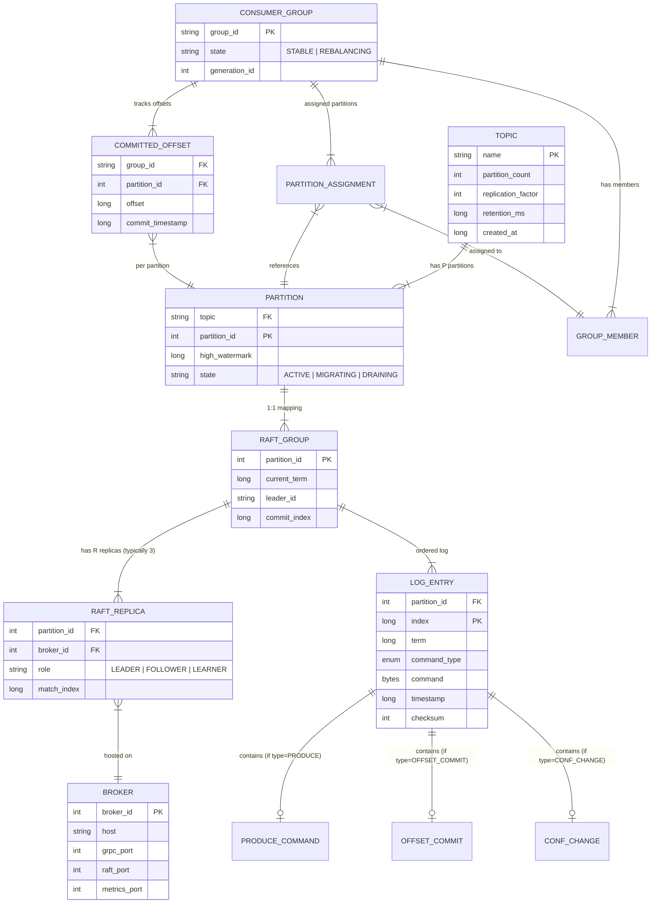

### RocksDB On-Disk Key Layout

The data models above are persisted in RocksDB using the following key schemas:

| Column Family | Key Pattern | Value | Size |
|---|---|---|---|
| `messages` | `[partition_id: 4B][offset: 8B]` | `[timestamp: 8B][header_count: 2B][headers: var][payload: var]` | 12B key + variable value |
| `metadata` | `[type: 1B][partition_id: 4B][sub_key: var]` | Varies by type | 5B+ key + variable value |
| `raft_log` | `[partition_id: 4B][log_index: 8B]` | `[term: 8B][command_type: 1B][command: var][checksum: 4B]` | 12B key + variable value |

All integer keys are big-endian encoded for correct lexicographic sort order in RocksDB's default byte comparator.

---

## Step 3: Back-of-the-Envelope Estimates

### Scenario: Event Backbone for a Ride-Sharing Platform

Consider a ride-sharing platform (comparable to Grab, Uber, or Lyft) using TurboMQ as its event backbone. Every ride generates a lifecycle of events: `ride_requested`, `driver_matched`, `driver_arrived`, `ride_started`, `ride_completed`, `payment_initiated`, `payment_completed`, plus GPS pings and ETA updates.

### Traffic Estimation

| Parameter | Value | Derivation |
|---|---|---|
| Daily rides | 100,000 | Mid-tier city operation |
| Events per ride | ~20 | 7 lifecycle + 10 GPS pings + 3 payment events |
| Daily events | 2,000,000 | 100K rides x 20 events |
| Average events/sec | ~23 | 2M / 86,400 |
| Peak multiplier | 10x | Rush hour (7-9 AM, 5-7 PM) |
| Peak events/sec | ~230 | 23 x 10 |
| At full scale (10 cities) | ~2,300 events/sec peak | 230 x 10 cities |

TurboMQ's single-node capacity of 50K msg/sec provides **21x headroom** over a 10-city peak. A 5-node cluster delivers 250K msg/sec aggregate capacity.

### Storage Estimation

| Parameter | Value | Derivation |
|---|---|---|
| Average message size | 1 KB | JSON event payload + headers |
| Write rate (per node, sustained) | 50,000 msg/sec | Design target |
| Daily writes per node | 4.32 billion | 50K x 86,400 |
| Daily raw data per node | 4.32 TB | 4.32B x 1 KB |
| Compression ratio (LZ4 on JSON) | 2.5x | Empirical; JSON compresses well |
| Daily compressed data per node | 1.73 TB | 4.32 TB / 2.5 |
| Replication factor | 3 | Default configuration |
| Daily total storage (cluster) | 5.18 TB | 1.73 TB x 3 replicas |
| Retention period | 7 days | Default TTL |
| Total storage at steady state | ~36 TB (cluster) | 5.18 TB x 7 days |
| Per-node storage at steady state | ~12 TB | 36 TB / 3 nodes |

With NVMe provisioned storage (AWS gp3 or io2 Block Express), 12 TB per node is operationally manageable. The TTL CompactionFilter ensures storage does not grow beyond the retention window.

### Memory Estimation

| Component | Per Node | Derivation |
|---|---|---|
| RocksDB block cache | 4 GB | Hot data serving; configurable. Default 1 GB per partition group, shared. |
| RocksDB memtables | 1.5 GB | 128 MB write_buffer x 3 memtables x ~4 active partitions in flush |
| Raft log buffer (in-flight entries) | 512 MB | Pipeline depth x batch size x partition count |
| Consumer offset cache | ~2 GB | 10K consumer groups x 1K partitions x 212 bytes/offset |
| Virtual thread stacks | ~10 MB | 10K partitions x ~1 KB continuation stack per virtual thread |
| JVM heap overhead | 2 GB | GC metadata, class loading, gRPC buffers |
| **Total per node** | **~10 GB** | Fits in a 16 GB JVM heap with headroom |

### Bandwidth Estimation

| Flow | Per Node | Derivation |
|---|---|---|
| Ingest (producers to leader) | 50 MB/sec | 50K msg/sec x 1 KB |
| Replication fan-out (leader to 2 followers) | 100 MB/sec | 50 MB/sec x 2 replicas |
| Consumer reads (tail consumers) | 50 MB/sec | Assume 1:1 read-to-write ratio (real-time consumers) |
| Consumer reads (catch-up) | Up to 200 MB/sec | Sequential NVMe reads with 4 MB readahead |
| **Total network I/O per node** | ~200-400 MB/sec | Well within 10 GbE (1.25 GB/sec) |

### QPS Estimation

| RPC | Per Node | Notes |
|---|---|---|
| Produce (unary + batch) | 50,000/sec | Raft-batched: ~1-5K AppendEntries RPCs/sec |
| Consume (server-streaming) | 100,000/sec | Consumers typically read faster than producers write |
| OffsetCommit | 1,000/sec | Periodic commits; not per-message |
| ClusterMeta | 100/sec | Client bootstrap and periodic refresh |
| Raft AppendEntries | 5,000/sec | Batched entries; pipeline depth 4 |
| Raft Heartbeats | 400K/sec | 10K partitions x 2 followers x 20 heartbeats/sec |

### Summary Table

| Dimension | Single Node | 3-Node Cluster | 5-Node Cluster |
|---|---|---|---|
| Write throughput | 50K msg/sec | 150K msg/sec | 250K msg/sec |
| Storage (7-day retention) | 12 TB | 36 TB | 60 TB |
| Memory | 10 GB | 30 GB | 50 GB |
| Network I/O | 200-400 MB/sec | 600 MB - 1.2 GB/sec | 1-2 GB/sec |
| Partitions | 10,000 | 10,000 (distributed) | 10,000 (distributed) |

---

## Step 4: High-Level System Design

### Unscaled Design (Why It Fails)

The simplest possible message queue: a single broker with a single partition and no replication.

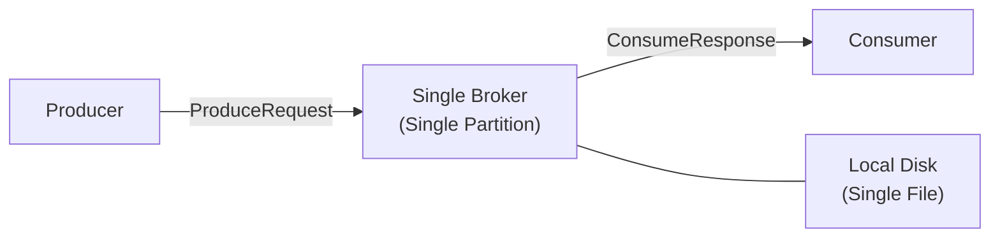

**Why this does not scale:**

| Limitation | Consequence |
|---|---|
| Single broker | Throughput ceiling: one machine's I/O bandwidth. No horizontal scaling. |
| No replication | Single point of failure: broker crash loses all uncommitted and potentially committed data. |
| Single partition | No consumer parallelism: only one consumer can read the topic. No key-based routing. |
| No consensus | No durability guarantee: a write acknowledged by the broker may be lost on crash before disk sync. |
| No metadata coordination | Clients hard-code the broker address. No leader discovery, no failover, no partition routing. |

### Scaled Design

TurboMQ's production architecture addresses every limitation above through per-partition Raft groups, multi-broker distribution, and gRPC-based client routing.

```mermaid
graph TD
    subgraph Producers["Producers"]
        PA["Producer A\n(Kotlin SDK)"]
        PB["Producer B\n(Python SDK)"]
        PC["Producer C\n(CLI)"]
    end

    LB["L4 Load Balancer\n(bootstrap only;\nclients direct-connect\nafter ClusterMeta)"]

    subgraph Cluster["TurboMQ Cluster (3 Brokers, RF=3)"]
        subgraph B1["Broker 1"]
            B1_P0["P0 Raft Leader\n(VT-0)"]
            B1_P2["P2 Raft Leader\n(VT-2)"]
            B1_P1F["P1 Follower\n(VT-1)"]
            B1_P3F["P3 Follower\n(VT-3)"]
            B1_RDB["RocksDB\n(CFs: P0, P1, P2, P3)"]
            B1_MET["Prometheus\nExporter :9092"]
        end

        subgraph B2["Broker 2"]
            B2_P1["P1 Raft Leader\n(VT-1)"]
            B2_P3["P3 Raft Leader\n(VT-3)"]
            B2_P0F["P0 Follower\n(VT-0)"]
            B2_P2F["P2 Follower\n(VT-2)"]
            B2_RDB["RocksDB\n(CFs: P0, P1, P2, P3)"]
            B2_MET["Prometheus\nExporter :9092"]
        end

        subgraph B3["Broker 3"]
            B3_P0F["P0 Follower\n(VT-0)"]
            B3_P1F["P1 Follower\n(VT-1)"]
            B3_P2F["P2 Follower\n(VT-2)"]
            B3_P3F["P3 Follower\n(VT-3)"]
            B3_RDB["RocksDB\n(CFs: P0, P1, P2, P3)"]
            B3_MET["Prometheus\nExporter :9092"]
        end
    end

    subgraph Consumers["Consumer Groups"]
        CGA["Consumer Group Alpha\n(2 members)"]
        CGB["Consumer Group Beta\n(1 member)"]
    end

    subgraph Observability["Observability"]
        PROM["Prometheus"]
        GRAF["Grafana\nDashboard"]
        ALERT["Alertmanager"]
    end

    PA --> LB
    PB --> LB
    PC --> LB
    LB --> B1
    LB --> B2
    LB --> B3

    PA -.->|"direct after\nClusterMeta"| B1_P0
    PB -.->|"direct after\nClusterMeta"| B2_P1

    B1_P0 -->|"AppendEntries"| B2_P0F
    B1_P0 -->|"AppendEntries"| B3_P0F
    B2_P1 -->|"AppendEntries"| B1_P1F
    B2_P1 -->|"AppendEntries"| B3_P1F
    B1_P2 -->|"AppendEntries"| B2_P2F
    B1_P2 -->|"AppendEntries"| B3_P2F
    B2_P3 -->|"AppendEntries"| B1_P3F
    B2_P3 -->|"AppendEntries"| B3_P3F

    B1 <-->|"Gossip\n(SWIM-lite)"| B2
    B2 <-->|"Gossip\n(SWIM-lite)"| B3
    B1 <-->|"Gossip\n(SWIM-lite)"| B3

    B1_P0 -->|"gRPC Stream"| CGA
    B2_P1 -->|"gRPC Stream"| CGB

    B1_P0 --> B1_RDB
    B1_P2 --> B1_RDB
    B2_P1 --> B2_RDB
    B2_P3 --> B2_RDB

    PROM --> B1_MET
    PROM --> B2_MET
    PROM --> B3_MET
    GRAF --> PROM
    ALERT --> PROM
```

### Architectural Decisions in the Scaled Design

| Decision | Rationale |
|---|---|
| **Per-partition Raft groups** | Each partition (P0, P1, P2, P3) runs its own independent Raft consensus group. P0's election on Broker 1 has zero causal relationship to P1's commit pipeline on Broker 2. Failure of Broker 2 affects only P1 and P3 (its led partitions); P0 and P2 continue uninterrupted. |
| **Virtual-thread-per-partition** | One Java 21 virtual thread (VT) per partition drives the Raft state machine. At 10K partitions, total heap for thread stacks is ~10 MB. No thread-pool sizing or contention management. |
| **RocksDB per-partition column families** | Each partition writes to its own column family. Compaction stalls in P0's CF do not block P1's writes. Shared WAL across CFs for crash recovery efficiency. |
| **L4 load balancer for bootstrap only** | Clients contact any broker via the LB to call `ClusterMeta`, which returns the partition-to-leader mapping. Subsequent produce/consume RPCs go directly to the partition leader, bypassing the LB. |
| **Gossip for metadata propagation** | SWIM-lite gossip protocol (push-pull, fanout=3, 500 ms interval) propagates partition assignments and leader changes between brokers. Eventually consistent; clients handle `NOT_LEADER` redirects gracefully. |
| **gRPC server-streaming for consume** | Consumers receive a stream of `RecordBatch` messages as they become available, reducing poll overhead and enabling sub-millisecond tail delivery for real-time consumers. |

---

## Step 5: Design Components in Detail

### Deep Dive: Per-Partition Raft Consensus Engine

This is the architectural differentiator that separates TurboMQ from Apache Kafka and every other message queue that relies on a centralized controller for partition management.

### 5.1 Why Per-Partition Raft

The core insight comes from CockroachDB's per-range Raft architecture: **if you scope consensus to the unit of data, failures become data-scoped, not cluster-scoped**.

In Kafka KRaft, a single controller Raft group manages metadata for all partitions in the cluster. The failure mode is asymmetric:

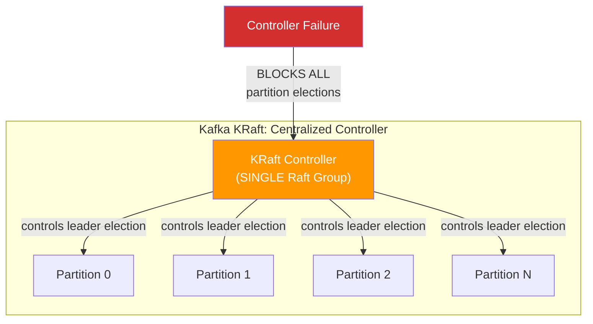

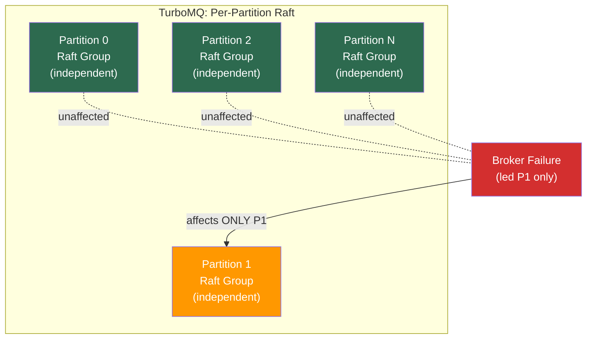

**Quantified impact:** In a 10,000-partition cluster across 3 brokers, a single broker failure under Kafka KRaft blocks all 10,000 partitions until the controller recovers (10-30 seconds for metadata replay). Under TurboMQ's per-partition Raft, the same failure affects ~3,333 partitions (those led by the failed broker), and recovery for all of them completes concurrently in under 500 ms. The remaining ~6,667 partitions never observe the failure.

### 5.2 Raft State Machine per Partition

Each partition maintains a fully independent Raft state machine. There is no shared state between partitions -- not even shared terms.

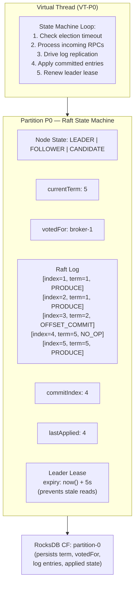

**Key properties of the per-partition state machine:**

- **Independent term counters.** P0 may be on term 5 while P1 is on term 12. Each partition's term reflects its own election history. A partition that has experienced more leader changes has a higher term; this has zero bearing on other partitions.
- **Independent log indices.** P0's log index 100 is unrelated to P1's log index 100. They may contain completely different commands at the same index number.
- **Independent leader leases.** Each leader maintains its own lease timer. A lease prevents stale reads by ensuring the leader has not been superseded. Lease expiry on P0 does not affect P1's lease.
- **Virtual thread isolation.** Each partition's Raft loop runs in its own virtual thread. A slow RocksDB write in P0's virtual thread does not block P1's election timeout processing because virtual threads park on I/O and do not hold a carrier thread.

### 5.3 Leader Election

Leader election is triggered when a follower's election timer expires without receiving a valid heartbeat from the current leader. The election is scoped entirely to the partition's Raft group -- only the 3 replicas of that partition participate.

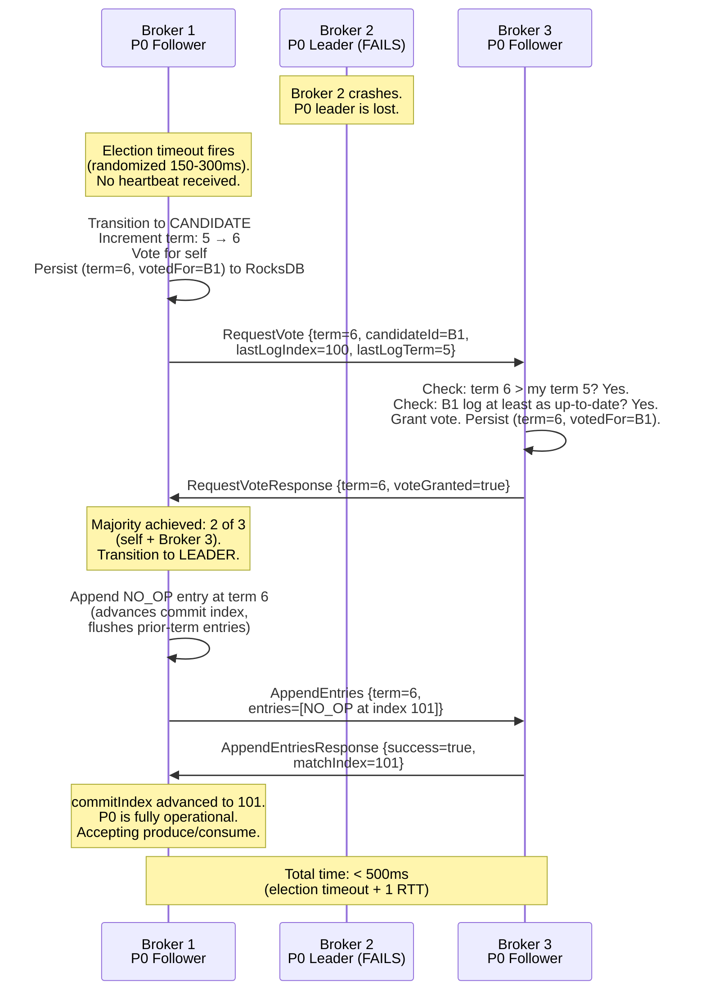

**Election timeline breakdown:**

| Phase | Duration | Notes |
|---|---|---|
| Heartbeat miss detection | ~100 ms | 2 missed heartbeats at 50 ms interval |
| Election timeout (randomized) | 150-300 ms | Per-partition randomization avoids synchronized elections |
| RequestVote RPC round-trip | < 1 ms | Same-datacenter |
| Vote persistence (RocksDB) | < 0.3 ms | WAL fsync |
| No-op commit (1 RTT to majority) | < 1 ms | Advances commit index |
| **Total** | **< 500 ms** | From failure to new leader serving |

**Pre-Vote extension.** Before a candidate increments its term, it sends a `PreVote` RPC. Peers respond affirmatively only if they have not received a recent heartbeat from a valid leader AND the candidate's log is sufficiently up-to-date. This prevents a network-partitioned node from accumulating a high term and forcing a disruptive election when it reconnects.

### 5.4 Log Replication (Produce Flow)

Every produce request flows through the Raft log replication pipeline. The leader appends the entry, replicates to followers, waits for quorum acknowledgment, and only then responds to the producer.

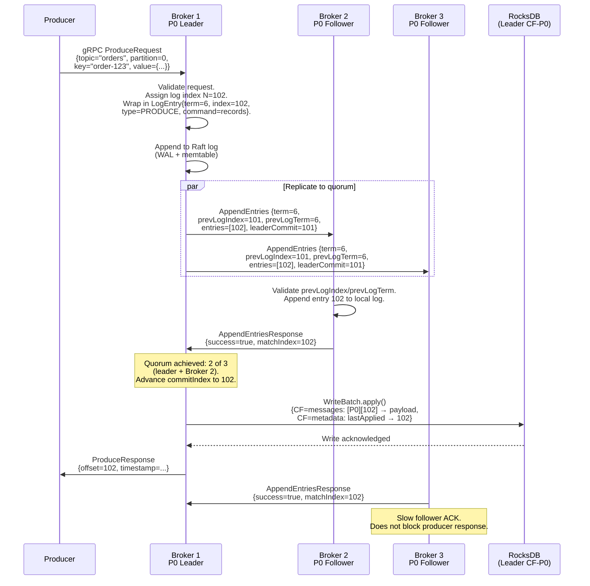

**Latency breakdown (P99 < 5 ms):**

| Phase | Duration | Component |
|---|---|---|
| gRPC decode + routing | ~0.1 ms | Netty HTTP/2 frame decode, partition router |
| Raft propose + WAL append | ~0.3 ms | Leader's WAL fsync (batched) |
| Network RTT to quorum | ~0.5-1.0 ms | To the fastest follower (same datacenter) |
| commitIndex advance | ~0.01 ms | In-memory index update |
| RocksDB WriteBatch apply | ~0.5-1.5 ms | State machine apply (WAL fsync) |
| gRPC encode + response | ~0.1 ms | Proto serialization + HTTP/2 frame |
| **Total P99** | **< 5 ms** | Dominated by network RTT + RocksDB write |

**Batching optimization.** Multiple concurrent produce requests arriving within `raft.batch.interval-ms` (default: 1 ms) are coalesced into a single Raft log entry. One `AppendEntries` RPC carries hundreds of messages, reducing RPC rate from 50K/sec to ~1-5K/sec and amortizing WAL fsync overhead.

### 5.5 Zero-Downtime Migration (ConfChange)

Partition migration -- moving a partition's replica from one broker to another -- is a critical operational workflow for capacity scaling, broker decommissioning, and load rebalancing. TurboMQ implements this as a Raft membership change (ConfChange), with zero consumer-visible downtime.

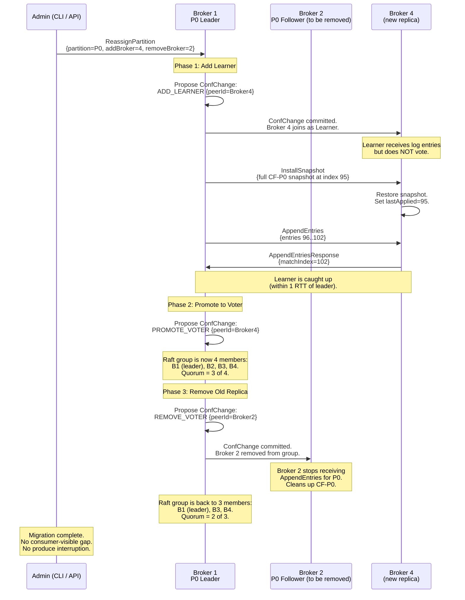

**Safety properties:**

| Property | Guarantee |
|---|---|
| **No quorum loss during migration** | `PROMOTE_VOTER` is applied before `REMOVE_VOTER`. The group transiently has 4 members (quorum = 3) during the crossover window. Quorum never drops below majority. |
| **No data loss** | The learner catches up from the leader's log (or snapshot + log). Only after the learner's `matchIndex` reaches the leader's `commitIndex` is it promoted to voter. |
| **No consumer-visible gap** | Producers and consumers interact only with the Raft leader throughout. The leader's commit pipeline continues uninterrupted during learner catch-up. |
| **Abort safety** | If the new node falls too far behind (network degraded), the migration is aborted via `REMOVE_LEARNER`. No committed data is affected. |

### 5.6 Offset Commits as Raft Entries

In Kafka, consumer offsets are stored in a special compacted topic (`__consumer_offsets`). This introduces a separate replication path with its own latency characteristics and failure modes.

TurboMQ eliminates this indirection: **consumer offset commits are written as Raft log entries in the partition's own Raft group.** The offset commit uses the same replication, quorum, and durability guarantees as a produce request.

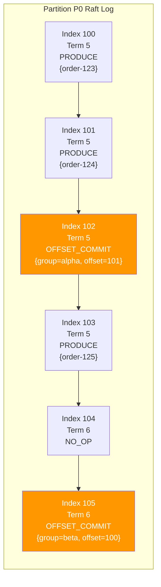

**Advantages over Kafka's `__consumer_offsets` topic:**

| Dimension | TurboMQ (Raft entries) | Kafka (`__consumer_offsets`) |
|---|---|---|
| Durability | Same Raft quorum as produce (linearizable) | Separate topic with its own replication lag |
| Latency | One Raft round-trip (< 5 ms P99) | Produce to `__consumer_offsets` + its own ISR ack |
| Failure mode | If partition leader fails, offsets recover with the partition | If `__consumer_offsets` partition leader fails, all groups on that partition are blocked |
| Consistency | Linearizable (Raft guarantee) | Eventually consistent (compacted topic semantics) |
| Operational overhead | No separate topic to manage | Must tune `__consumer_offsets` partition count, retention, and compaction independently |

---

## Step 6: Service Definitions, APIs, Interfaces

### 6.1 ProducerService (gRPC — Client-Facing)

```protobuf
service ProducerService {
    // Produce a single record to a partition.
    // Returns the assigned offset after Raft commit (at-least-once by default).
    rpc Produce(ProduceRequest) returns (ProduceResponse);

    // Produce a batch of records in a single RPC.
    // All records in the batch target the same topic+partition.
    // Atomically committed as one Raft log entry.
    rpc BatchProduce(BatchProduceRequest) returns (BatchProduceResponse);
}

message ProduceRequest {
    string topic = 1;                       // Topic name (max 128 chars)
    int32 partition = 2;                    // Target partition (-1 for key-based routing)
    bytes key = 3;                          // Partition routing key (max 256 bytes)
    bytes value = 4;                        // Message payload (max 1 MB)
    map<string, bytes> headers = 5;         // Optional metadata headers
    int64 timestamp = 6;                    // Producer-assigned epoch ms (0 = server-assigned)
    int64 producer_id = 7;                  // Idempotent producer ID (0 = non-idempotent)
    int32 sequence_number = 8;              // Per-producer sequence for dedup
}

message ProduceResponse {
    int64 offset = 1;                       // Assigned log offset (committed)
    int64 timestamp = 2;                    // Final timestamp (server-assigned if input was 0)
    ErrorCode error = 3;                    // OK, NOT_LEADER, INVALID_TOPIC, MESSAGE_TOO_LARGE
    string leader_hint = 4;                 // Current leader address (populated on NOT_LEADER)
}

message BatchProduceRequest {
    string topic = 1;
    int32 partition = 2;
    repeated ProduceRecord records = 3;     // All records in one Raft entry
    int64 producer_id = 4;
    int32 first_sequence = 5;               // Sequence of first record in batch
}

message ProduceRecord {
    bytes key = 1;
    bytes value = 2;
    map<string, bytes> headers = 3;
    int64 timestamp = 4;
}

message BatchProduceResponse {
    int64 base_offset = 1;                  // Offset of first record in batch
    int32 record_count = 2;                 // Number of records committed
    int64 timestamp = 3;
    ErrorCode error = 4;
    string leader_hint = 5;
}
```

### 6.2 ConsumerService (gRPC -- Client-Facing)

```protobuf
service ConsumerService {
    // Fetch records starting at a given offset.
    // Returns a server-stream of RecordBatch messages.
    rpc Consume(ConsumeRequest) returns (stream RecordBatch);

    // Subscribe to a partition with long-polling.
    // Stream stays open; server pushes new batches as they are committed.
    rpc Subscribe(SubscribeRequest) returns (stream RecordBatch);

    // Commit consumer group offset for a partition.
    // Written as a Raft log entry (linearizable).
    rpc CommitOffset(CommitOffsetRequest) returns (CommitOffsetResponse);

    // Fetch the last committed offset for a consumer group + partition.
    rpc FetchOffset(FetchOffsetRequest) returns (FetchOffsetResponse);
}

message ConsumeRequest {
    string topic = 1;                       // Topic name
    int32 partition = 2;                    // Target partition
    string consumer_group = 3;             // Consumer group ID
    int64 offset = 4;                       // Start offset (-1 = last committed, -2 = earliest)
    int32 max_bytes = 5;                    // Max response payload (default: 1 MB)
    int32 max_wait_ms = 6;                  // Max wait for new data (default: 500 ms)
}

message SubscribeRequest {
    string topic = 1;
    int32 partition = 2;
    string consumer_group = 3;
    int64 start_offset = 4;                 // -1 = last committed, -2 = earliest
    int32 max_batch_bytes = 5;              // Max bytes per streamed batch
}

message RecordBatch {
    int64 base_offset = 1;                  // Offset of first record
    repeated Record records = 2;
    int64 next_offset = 3;                  // Next offset to request (base_offset + record_count)
    int64 high_watermark = 4;               // Partition's current committed offset
}

message Record {
    int64 offset = 1;
    bytes key = 2;
    bytes value = 3;
    map<string, bytes> headers = 4;
    int64 timestamp = 5;
}

message CommitOffsetRequest {
    string consumer_group = 1;
    string topic = 2;
    int32 partition = 3;
    int64 offset = 4;                       // Next offset to read on resume
}

message CommitOffsetResponse {
    bool success = 1;
    ErrorCode error = 2;                    // OK, NOT_LEADER, UNKNOWN_GROUP
    string leader_hint = 3;
}

message FetchOffsetRequest {
    string consumer_group = 1;
    string topic = 2;
    int32 partition = 3;
}

message FetchOffsetResponse {
    int64 offset = 1;                       // -1 if no committed offset exists
    int64 commit_timestamp = 2;
    ErrorCode error = 3;
}
```

### 6.3 ClusterService (gRPC -- Client-Facing)

```protobuf
service ClusterService {
    // Returns the partition-to-leader mapping for all topics.
    // Used by SDKs for initial bootstrap and periodic metadata refresh.
    rpc GetClusterMeta(ClusterMetaRequest) returns (ClusterMetaResponse);

    // Returns detailed info for a specific partition (leader, replicas, Raft term).
    rpc GetPartitionInfo(PartitionInfoRequest) returns (PartitionInfoResponse);

    // Administrative: create a topic with specified partition count and RF.
    rpc CreateTopic(CreateTopicRequest) returns (CreateTopicResponse);

    // Administrative: reassign a partition replica to a different broker.
    rpc ReassignPartition(ReassignPartitionRequest) returns (ReassignPartitionResponse);
}

message ClusterMetaRequest {
    repeated string topics = 1;             // Empty = all topics
}

message ClusterMetaResponse {
    repeated BrokerInfo brokers = 1;
    repeated TopicMeta topics = 2;
}

message BrokerInfo {
    int32 broker_id = 1;
    string host = 2;
    int32 grpc_port = 3;
    int32 raft_port = 4;
    bool is_alive = 5;
}

message TopicMeta {
    string topic = 1;
    repeated PartitionMeta partitions = 2;
}

message PartitionMeta {
    int32 partition_id = 1;
    int32 leader_broker_id = 2;             // -1 if no leader (election in progress)
    string leader_address = 3;
    repeated int32 replica_broker_ids = 4;
    int64 raft_term = 5;
}

message PartitionInfoRequest {
    string topic = 1;
    int32 partition = 2;
}

message PartitionInfoResponse {
    PartitionMeta meta = 1;
    int64 commit_index = 2;
    int64 high_watermark = 3;
    string partition_state = 4;             // ACTIVE, MIGRATING, DRAINING
    repeated ReplicaDetail replicas = 5;
}

message ReplicaDetail {
    int32 broker_id = 1;
    string role = 2;                        // LEADER, FOLLOWER, LEARNER
    int64 match_index = 3;                  // How far behind the leader
    bool is_alive = 4;
}
```

### 6.4 RaftService (Internal gRPC -- Broker-to-Broker)

```protobuf
// Internal service: broker-to-broker Raft protocol.
// Not exposed to clients. Runs on RAFT_PORT (default 9091).
service RaftService {
    // Log replication + heartbeat. Leader sends to all followers.
    rpc AppendEntries(AppendEntriesRequest) returns (AppendEntriesResponse);

    // Leader election. Candidate sends to all peers in the Raft group.
    rpc RequestVote(RequestVoteRequest) returns (RequestVoteResponse);

    // Pre-vote (dissertation section 9.6). Prevents disruptive elections
    // from nodes returning from network partitions.
    rpc PreVote(PreVoteRequest) returns (PreVoteResponse);

    // Full snapshot transfer when a follower is too far behind for log replay.
    rpc InstallSnapshot(stream InstallSnapshotChunk) returns (InstallSnapshotResponse);

    // Membership change: add learner, promote voter, remove voter.
    rpc ConfChange(ConfChangeRequest) returns (ConfChangeResponse);
}

message AppendEntriesRequest {
    int32 partition_id = 1;                 // Demux key: routes to correct Raft state machine
    int64 term = 2;
    int32 leader_id = 3;
    int64 prev_log_index = 4;
    int64 prev_log_term = 5;
    repeated LogEntryProto entries = 6;     // Empty = heartbeat
    int64 leader_commit = 7;
}

message AppendEntriesResponse {
    int32 partition_id = 1;
    int64 term = 2;
    bool success = 3;
    int64 match_index = 4;                  // Follower's highest replicated index
    int64 conflict_index = 5;               // Optimization: index of first conflicting entry
    int64 conflict_term = 6;                // Term at conflict_index (for fast backtrack)
}

message RequestVoteRequest {
    int32 partition_id = 1;
    int64 term = 2;
    int32 candidate_id = 3;
    int64 last_log_index = 4;
    int64 last_log_term = 5;
}

message RequestVoteResponse {
    int32 partition_id = 1;
    int64 term = 2;
    bool vote_granted = 3;
}

message PreVoteRequest {
    int32 partition_id = 1;
    int64 term = 2;                         // Hypothetical term (current + 1)
    int32 candidate_id = 3;
    int64 last_log_index = 4;
    int64 last_log_term = 5;
}

message PreVoteResponse {
    int32 partition_id = 1;
    int64 term = 2;
    bool vote_granted = 3;
}

message InstallSnapshotChunk {
    int32 partition_id = 1;
    int64 term = 2;
    int32 leader_id = 3;
    int64 last_included_index = 4;
    int64 last_included_term = 5;
    int64 offset = 6;                       // Byte offset within the snapshot
    bytes data = 7;                         // Chunk data (default chunk size: 4 MB)
    bool done = 8;                          // Last chunk flag
}

message InstallSnapshotResponse {
    int32 partition_id = 1;
    int64 term = 2;
    bool success = 3;
}

message ConfChangeRequest {
    int32 partition_id = 1;
    int64 term = 2;
    ConfChangeType change_type = 3;
    int32 peer_id = 4;
    string peer_address = 5;
}

enum ConfChangeType {
    ADD_LEARNER = 0;
    PROMOTE_VOTER = 1;
    REMOVE_VOTER = 2;
}

message ConfChangeResponse {
    int32 partition_id = 1;
    bool success = 2;
    string error_message = 3;
}

message LogEntryProto {
    int64 term = 1;
    int64 index = 2;
    CommandType command_type = 3;
    bytes command = 4;
    int64 timestamp = 5;
    uint32 checksum = 6;
}

enum CommandType {
    PRODUCE = 0;
    OFFSET_COMMIT = 1;
    CONF_CHANGE = 2;
    NO_OP = 3;
}

enum ErrorCode {
    OK = 0;
    NOT_LEADER = 1;
    INVALID_TOPIC = 2;
    UNKNOWN_PARTITION = 3;
    MESSAGE_TOO_LARGE = 4;
    UNKNOWN_GROUP = 5;
    REBALANCE_IN_PROGRESS = 6;
    TIMEOUT = 7;
    INTERNAL_ERROR = 8;
}
```

### 6.5 API Summary Matrix

| Service | RPC | Transport | Auth | Rate Limit |
|---|---|---|---|---|
| ProducerService | `Produce` | Unary | mTLS | Per-topic quota |
| ProducerService | `BatchProduce` | Unary | mTLS | Per-topic quota |
| ConsumerService | `Consume` | Server-streaming | mTLS | Per-group quota |
| ConsumerService | `Subscribe` | Server-streaming | mTLS | Per-group quota |
| ConsumerService | `CommitOffset` | Unary | mTLS | Per-group quota |
| ConsumerService | `FetchOffset` | Unary | mTLS | Per-group quota |
| ClusterService | `GetClusterMeta` | Unary | mTLS | 100 req/sec |
| ClusterService | `GetPartitionInfo` | Unary | mTLS | 100 req/sec |
| ClusterService | `CreateTopic` | Unary | mTLS + RBAC | Admin only |
| ClusterService | `ReassignPartition` | Unary | mTLS + RBAC | Admin only |
| RaftService | `AppendEntries` | Unary | mTLS (internal) | None (internal) |
| RaftService | `RequestVote` | Unary | mTLS (internal) | None (internal) |
| RaftService | `PreVote` | Unary | mTLS (internal) | None (internal) |
| RaftService | `InstallSnapshot` | Client-streaming | mTLS (internal) | None (internal) |
| RaftService | `ConfChange` | Unary | mTLS (internal) | None (internal) |

---

## Step 7: Scaling Problems and Bottlenecks

### 7.1 Hot Partition (Skewed Traffic Distribution)

**Problem.** One partition receives disproportionately more traffic than others. For example, a popular merchant's events all hash to the same partition key. The Raft leader for that partition becomes CPU-bound on log replication, while other leaders are idle.

**Symptoms:**
- Single-partition produce latency P99 spikes above 5 ms while cluster-wide average remains low.
- Raft replication lag for the hot partition's followers grows continuously.
- RocksDB compaction for the hot partition's column family falls behind, increasing read amplification.

**Solutions:**

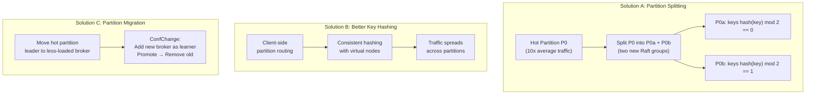

| Solution | Pros | Cons |
|---|---|---|
| **Partition splitting** | Directly addresses the skew; two smaller Raft groups each handle half the traffic | Requires coordinating producers to update their partition map; consumers must handle the split boundary; complex to implement (create two new Raft groups, migrate data) |
| **Better key hashing** | No infrastructure change; purely client-side | Does not help if the skew is inherent to the data (one entity generates most events) |
| **Leader migration** | Simple: uses existing ConfChange mechanism; moves the leader to a broker with more headroom | Does not reduce the per-partition load; just shifts it to a different broker |

**Recommended approach.** Start with leader migration (zero code change, uses existing ConfChange). If skew persists, implement partition splitting as a controlled operation through the AdminService.

### 7.2 Raft Log Divergence During Network Partition

**Problem.** During a network partition, a minority-side follower may increment its term repeatedly (election timeouts with no quorum) and accumulate log entries at high terms that were never committed. When the partition heals, this node's log diverges from the leader's log. If not handled correctly, the node could corrupt the committed log by overwriting committed entries with uncommitted ones.

**Symptoms:**
- Follower reports `conflictIndex` and `conflictTerm` in `AppendEntriesResponse`.
- Leader detects that the follower's log at `prevLogIndex` has a different term than expected.
- Follower's term is significantly higher than the leader's after reconnection (without pre-vote).

**Solutions:**

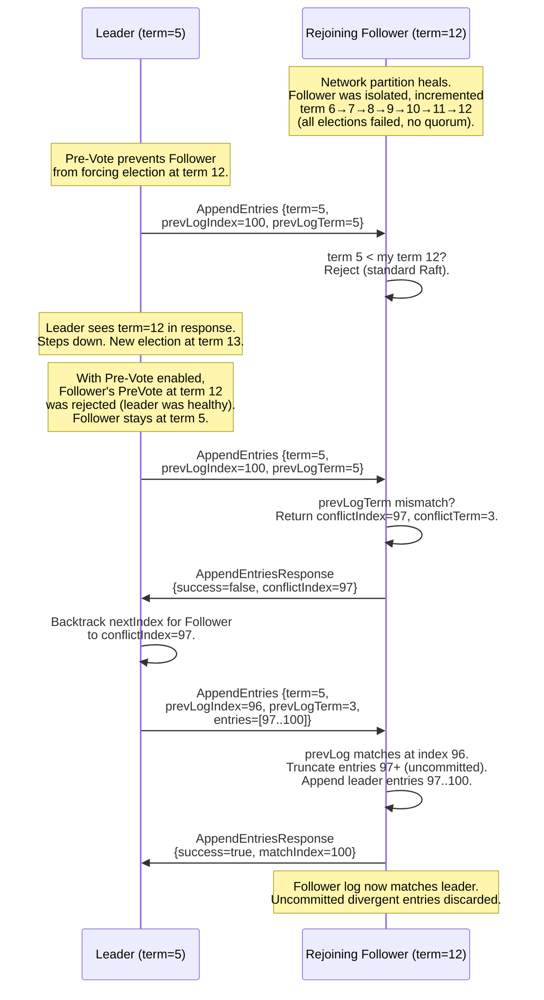

| Mitigation | Mechanism |
|---|---|
| **Pre-Vote** | Prevents isolated nodes from accumulating high terms. The follower must get pre-vote approval (peers confirm no recent heartbeat) before incrementing its term. Default: enabled. |
| **Term-based conflict resolution** | Standard Raft: leader's `AppendEntries` includes `prevLogIndex` and `prevLogTerm`. Follower rejects if mismatch; leader backtracks. Uncommitted entries on the follower are truncated. |
| **Fast log backtracking** | Optimization: follower returns `conflictIndex` and `conflictTerm` in the rejection response. Leader skips directly to the conflict point instead of decrementing by one index at a time. |
| **Leader lease expiry** | A leader that cannot heartbeat a majority within the lease window stops accepting new writes. This prevents split-brain writes during asymmetric partitions. |

### 7.3 RocksDB Compaction Spikes Causing Latency Jitter

**Problem.** Leveled compaction rewrites entire SSTable levels when the size threshold is exceeded. During a large L1-to-L2 compaction, RocksDB's background compaction threads compete with foreground write threads for I/O bandwidth, causing produce latency spikes (P99 > 10 ms vs. the normal < 5 ms target).

**Symptoms:**
- Periodic P99 latency spikes every 30-60 seconds, correlating with compaction activity in Grafana.
- `rocksdb.compaction.pending.bytes` gauge spikes; `rocksdb.stall.micros` counter increases.
- NVMe device utilization reaches 100% during compaction bursts.

**Solutions:**

| Solution | Mechanism | Trade-off |
|---|---|---|
| **Rate-limited compaction** | `setMaxCompactionBytes(256 * 1024 * 1024)` and `setRateLimiter(RateLimiter(100 * 1024 * 1024))` caps compaction I/O at 100 MB/sec, leaving headroom for foreground writes. | Compaction falls behind under sustained high write rates; storage grows temporarily until compaction catches up during lower-traffic periods. |
| **Tiered compaction for L0** | Use `CompactionPri.kMinOverlappingRatio` to prioritize L0 files with minimal overlap against L1, reducing compaction write amplification for the most latency-sensitive level. | Slightly higher space amplification at L0 (overlapping key ranges persist longer). |
| **TTL CompactionFilter** | `TtlCompactionFilter(retentionMs)` drops expired messages during compaction, reducing the effective data volume that must be compacted through lower levels. | Only effective when retention is short relative to data volume. With 7-day retention and low write rates, most data survives to L2+ before expiring. |
| **Dedicated compaction thread pool** | `setMaxBackgroundCompactions(4)` with CPU affinity set to cores not used by Raft virtual threads, isolating compaction I/O contention from the produce path. | Requires careful CPU pinning; virtual threads' carrier thread pool must not overlap with compaction threads. |
| **Sub-compaction parallelism** | `setMaxSubcompactions(2)` splits large compaction jobs into sub-ranges processed in parallel, reducing wall-clock compaction time by 2x at the cost of higher peak I/O. | Higher burst I/O; may still cause latency spikes if rate limiter is not configured. |

**Recommended approach.** Combine rate-limited compaction (100 MB/sec cap) with the TTL CompactionFilter and dedicated compaction threads. Monitor `rocksdb.stall.micros` in Grafana and increase the rate limit if compaction pending bytes grow continuously.

### 7.4 Consumer Group Rebalance Storm

**Problem.** When a consumer in a group crashes, the consumer group coordinator detects the failure via missed heartbeats (`sessionTimeoutMs`, default: 30s) and triggers a rebalance. In a naive implementation, all partitions assigned to the group are revoked and redistributed simultaneously. If the group has 100 partitions across 10 consumers, all 100 partitions briefly have no active consumer, causing a processing gap.

Worse, if consumers are unstable (e.g., OOM kills in a tight loop), the rebalance can cascade: each rebalance triggers more timeouts, which triggers more rebalances.

**Symptoms:**
- `consumer_group_rebalance_count` metric spikes repeatedly.
- Consumer lag increases across all partitions in the group during rebalance.
- Application-level processing stalls for the duration of the rebalance (typically 5-15 seconds).

**Solutions:**

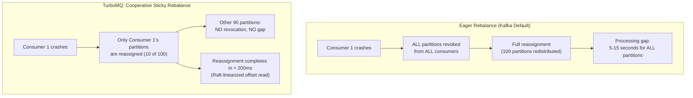

| Solution | Mechanism | Impact |
|---|---|---|
| **Sticky partition assignment** | Partitions stay with their current consumer across rebalances unless the consumer is removed. Only the crashed consumer's partitions move. Minimizes partition migration. | 90% fewer partition movements. Consumer lag spike limited to the failed consumer's partitions. |
| **Cooperative rebalance protocol** | Two-phase rebalance: (1) consumers report their current assignment, (2) coordinator computes the diff and only revokes partitions that need to move. Consumers that keep their partitions never stop processing. | Zero processing gap for unaffected partitions. Slightly longer rebalance latency (two round-trips vs. one). |
| **Incremental rebalance** | Instead of waiting for all consumers to rejoin, the coordinator assigns orphaned partitions immediately to available consumers in the next heartbeat cycle. | Faster recovery: orphaned partitions are reassigned within one heartbeat interval (500 ms), not one full rebalance cycle. |
| **Static group membership** | Consumers with stable identities (`group.instance.id`) are not immediately considered dead on missed heartbeats. Instead, a longer `session.timeout.ms` (5 minutes) allows for transient failures without triggering rebalance. | Prevents rebalance storms from transient failures (GC pauses, network blips). Trade-off: truly dead consumers are detected much later. |

**Recommended approach.** TurboMQ defaults to cooperative sticky rebalance with incremental assignment. Static group membership is opt-in for workloads with known-stable consumer identities.

### 7.5 Scaling Bottleneck Summary

| Bottleneck | Detection Signal | First Response | Long-Term Fix |
|---|---|---|---|
| Hot partition | Single-partition P99 spike; follower lag growth | Leader migration (ConfChange) | Partition splitting |
| Raft log divergence | `conflictIndex` in AppendEntriesResponse | Pre-Vote (enabled by default) | Fast log backtracking with conflict hint |
| Compaction latency spikes | `rocksdb.stall.micros` increase; P99 jitter | Rate-limited compaction (100 MB/sec) | Dedicated compaction threads + TTL filter |
| Rebalance storm | `rebalance_count` spike; consumer lag all partitions | Cooperative sticky rebalance | Static group membership for stable consumers |
| Heartbeat overhead at scale | Raft heartbeat traffic > 10% of network bandwidth | Increase `heartbeatIntervalMs` (50 → 100 ms) | Heartbeat coalescing (batch heartbeats per broker pair) |
| Snapshot transfer during migration | High network I/O during ConfChange | Rate-limited snapshot streaming (50 MB/sec) | Incremental snapshot (only changed SST files) |

---

## References

- Ongaro, D. & Ousterhout, J. (2014). "In Search of an Understandable Consensus Algorithm." USENIX ATC.
- Kleppmann, M. (2017). *Designing Data-Intensive Applications*. O'Reilly. Chapters 3, 6, 9.
- Petrov, A. (2019). *Database Internals*. O'Reilly. Chapters 7, 14.
- CockroachDB Architecture Documentation. Per-range Raft design.
- JEP 444: Virtual Threads (Project Loom). OpenJDK.
- Facebook Engineering. "RocksDB: A Persistent Key-Value Store for Fast Storage Environments."
- Chiang, S. *Hacking the System Design Interview*. Seven-step methodology.

---

## See Also

| Document | Description |
|---|---|
| [Architecture Deep Dive](architecture.md) | Per-partition Raft design, WAL layout, leader lease protocol, ConfChange-based partition migration |
| [Raft Consensus](raft-consensus.md) | Per-partition Raft deep dive, leader election, log replication, pre-vote extension |
| [Storage Engine](storage-engine.md) | RocksDB integration, LSM-tree structure, write/read paths, compaction strategy |
| [API Reference](api-and-sdks.md) | Full Protocol Buffer service definitions, SDK usage, delivery guarantees |
