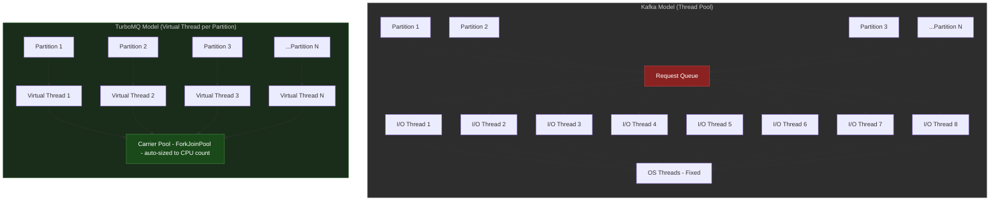
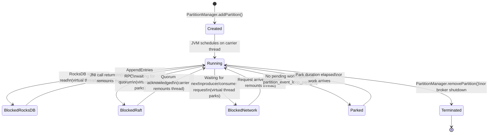
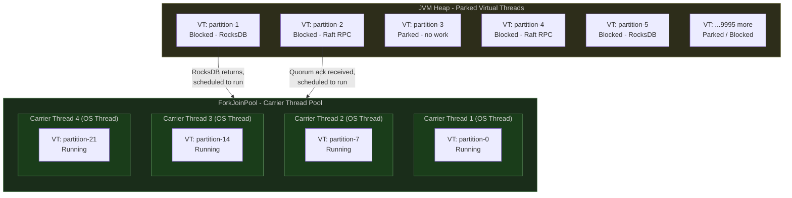
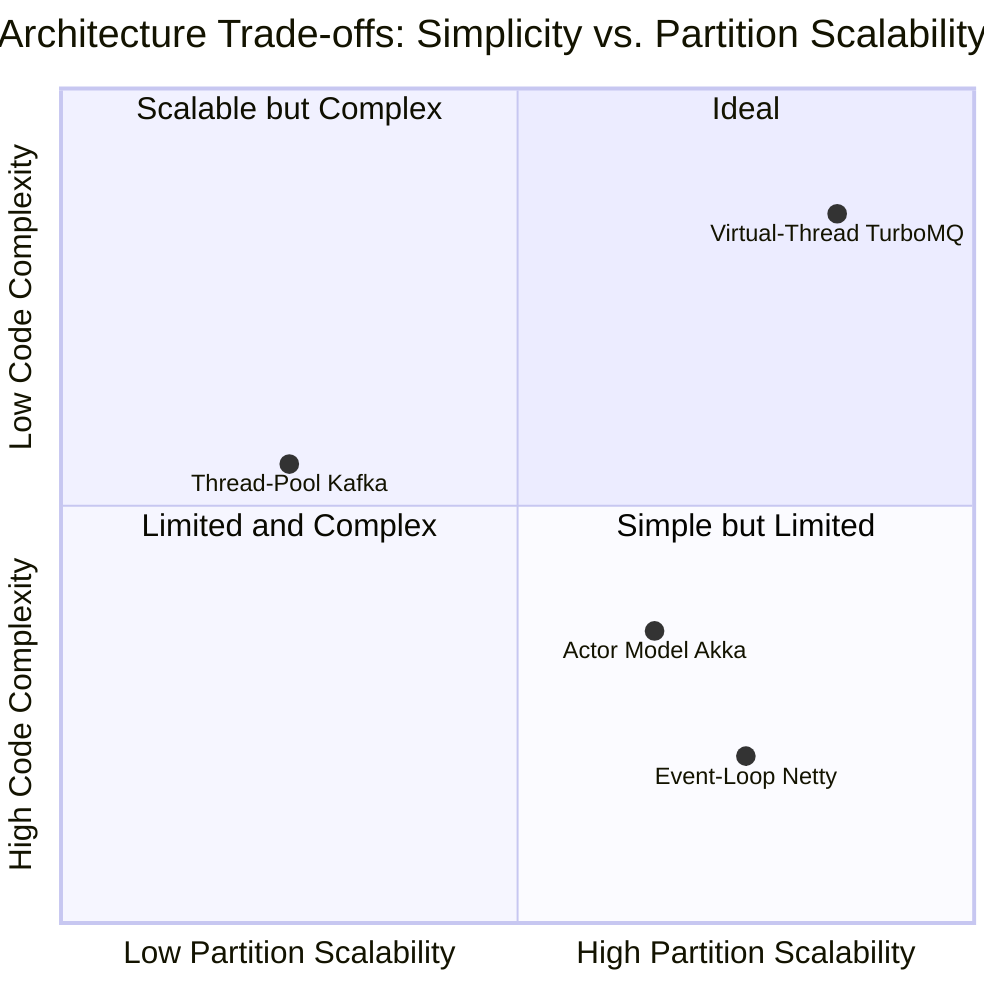

# Virtual-Thread-per-Partition Architecture

## Overview

TurboMQ's concurrency model is built on a single architectural principle: every partition gets its own virtual thread. This eliminates the fundamental scalability bottleneck in traditional broker designs — the shared thread pool — while keeping the code as simple and debuggable as single-threaded sequential logic.

This document explains why the traditional model breaks at scale, how Java 21 virtual threads solve the problem, and how TurboMQ's implementation exploits this to achieve practical support for 50,000+ partitions per broker with standard hardware.

---

## 1. The Problem: Thread Pools in Traditional Brokers

### Kafka's Threading Architecture

Apache Kafka uses a fixed-size thread pool architecture shared across all partitions on a broker:

- **Network threads** (`num.network.threads`, default `3`): Accept and dispatch incoming requests.
- **I/O threads** (`num.io.threads`, default `8`): Perform the actual work — write to the log, read for fetch requests, respond.

These thread pools are **global resources shared across every partition on the broker**. If a broker hosts 2,000 partitions, all 2,000 partitions compete for the same 8 I/O threads.

### The Tuning Pain

The pool-sizing problem is precisely characterized in *Java Concurrency in Practice* (Goetz, Ch. 8, "Applying Thread Pools"):

> "For compute-intensive tasks, an Ncpu-processor system usually achieves optimum utilization with a thread pool of Ncpu+1 threads. For tasks that also include I/O or other blocking operations, you want a larger pool, since not all of the threads will be schedulable at all times."

The formula `N_threads = N_cpu × U_cpu × (1 + W/C)` (where W/C is wait-to-compute ratio) gives a starting point but never a definitive answer because:

- W/C varies per request type (produce vs. fetch vs. metadata).
- W/C varies with load (RocksDB compaction increases I/O latency under write pressure).
- The optimal value for one workload profile breaks another.

This means operators are perpetually re-tuning `num.io.threads` and accepting suboptimal utilization on one side of the trade-off or excessive context-switch overhead on the other.

### Contention Grows with Partitions

The deeper issue is that the bottleneck **scales with the number of partitions, not with CPU cores**. As partition count grows:

1. More requests arrive per unit time.
2. All compete for the same fixed-size queue feeding the thread pool.
3. Lock contention on the queue increases.
4. P99 latency degrades even when average throughput appears acceptable.

At 10,000 partitions, the 8-thread pool must process an average of 1,250 partitions worth of I/O per thread. Any partition experiencing a slow RocksDB operation blocks the thread from serving the other 1,249 partitions it is responsible for. This is not a configuration problem — it is a structural one.

---

## 2. The Insight: One Virtual Thread per Partition

### Java 21 Virtual Threads (JEP 444)

Java 21 introduced virtual threads as a first-class feature of the JVM. The key properties that make TurboMQ's architecture possible:

| Property | Platform Thread | Virtual Thread |
|---|---|---|
| Managed by | OS scheduler | JVM scheduler |
| Stack size | ~1 MB (OS-allocated) | ~1 KB (heap-allocated, grows lazily) |
| Creation cost | ~1 ms, ~1 MB | ~1 µs, ~1 KB |
| Blocking cost | Blocks OS thread | Parks virtual thread, carrier thread free |
| Max practical count | ~10,000 per JVM | Millions per JVM |

### Memory Math at Scale

The memory difference at 10,000 partitions is the decisive factor:

- **Platform threads**: 10,000 × 1 MB = **10 GB** just for thread stacks.
- **Virtual threads**: 10,000 × ~1 KB = **~10 MB** for thread stacks.

At 50,000 partitions, platform threads require ~50 GB of memory for stacks alone — before any heap allocation. Virtual threads require ~50 MB. This is not a marginal improvement; it is the difference between possible and impossible.

### Why Simple Blocking Code is Correct

With platform threads, blocking code is a performance hazard because it wastes a scarce OS resource. This drove the adoption of async/reactive frameworks (Netty, Project Reactor, Vert.x) which replace blocking calls with callbacks and promises.

Virtual threads invert this trade-off: blocking a virtual thread is free from the OS perspective because the underlying carrier thread is immediately available to run other virtual threads. This means:

- Sequential, imperative code can be written without performance penalty.
- No callback hell, no reactive pipeline debugging, no CompletableFuture chains.
- Standard stack traces. Standard debuggers. Standard profilers.
- RocksDB's blocking JNI API can be called directly.

Each partition's virtual thread runs a straightforward event loop: read a request, process it, write a response, repeat.

---

## 3. Architecture

### Platform Threads vs. Virtual Threads — Side by Side



The left model has a single contention point — the request queue. Every partition must compete for a position in the I/O thread pool. The right model has no shared queue: each partition's virtual thread processes requests independently and blocks without affecting any other partition.

### Virtual Thread Lifecycle per Partition



When a virtual thread parks (any `Blocked` state), the carrier thread that was running it immediately picks up another runnable virtual thread. There is no OS scheduler involvement, no context-switch cost beyond saving/restoring the virtual thread's stack frame pointer.

### Per-Partition Thread Responsibilities

Each partition's virtual thread is exclusively responsible for all work on that partition:

1. **Handle produce requests** — receive batches from producers, write to the Raft log buffer, return acknowledgement per configured `acks` level.
2. **Raft tick** — drive the Raft state machine: send leader heartbeats on interval, check follower election timeout, transition state on timeout.
3. **Process AppendEntries** — as leader, replicate log entries to followers via gRPC; as follower, apply received entries from the leader to local log.
4. **Apply committed entries to RocksDB** — once Raft consensus is achieved, apply committed log entries to the RocksDB state machine (the actual message store).
5. **Serve consumer fetch requests** — read committed messages from RocksDB for consumer groups, track offsets, handle `FetchWaitMaxMs` long-poll blocking.
6. **Handle admin operations** — process configuration changes, trigger snapshot creation, apply snapshot installation from leader during follower catch-up.

No partition ever touches another partition's data. Cross-partition operations (e.g., a transaction spanning multiple partitions) are coordinated via explicit message passing between virtual threads, never by sharing state.

---

## 4. Why This Works — Virtual Thread Scheduling

### The Carrier Pool



The carrier pool has one platform thread per CPU core (default). At any moment, each carrier thread runs exactly one virtual thread. All other virtual threads live in the JVM heap as lightweight objects, either parked awaiting work or blocked awaiting I/O completion.

### Key Properties

**No thread pool tuning.** The carrier pool is auto-sized to `Runtime.availableProcessors()`. The JVM knows how many cores are available and sizes accordingly. Operators do not tune `num.io.threads`. The system self-configures.

**Blocking is free.** When a virtual thread calls a blocking operation (RocksDB read, gRPC call, `LockSupport.park()`), the JVM unmounts it from the carrier thread and places it in the heap. The carrier thread immediately executes a different runnable virtual thread. No OS context switch occurs; only the virtual thread's continuation pointer is swapped.

**Fair scheduling via work-stealing.** The ForkJoinPool uses work-stealing: idle carrier threads steal runnable virtual threads from busy carrier threads' queues. This prevents the starvation scenario common in naive thread pools where one thread processes a long queue while others sit idle.

**Natural backpressure.** If a partition is overloaded — its virtual thread spends most of its time blocked on slow RocksDB writes — the virtual thread simply parks more often and for longer. This has zero effect on other partitions. Contrast with the shared thread pool model where a slow partition consumes a thread that other partitions need.

This is the resolution to the JCIP Ch. 8 "Sizing Thread Pools" problem: the optimal pool size is never a fixed number because workload characteristics change. Virtual threads eliminate the need to calculate the optimal number because carrier threads self-manage via work-stealing and virtual threads do not consume carrier threads while blocked.

---

## 5. Scalability Analysis

### Memory and Feasibility at Scale

| Partitions per Broker | Platform Thread Model | Virtual Thread Model | Memory (Platform) | Memory (Virtual) |
|---|---|---|---|---|
| 100 | Comfortable — 8 threads serve 100 partitions with low contention | 100 VTs — trivial overhead | 100 MB | 100 KB |
| 1,000 | Strained — thread pool contention visible in P99 latency; operators increase `num.io.threads` to 32+ | 1,000 VTs — no configuration change | 1 GB | 1 MB |
| 10,000 | Impractical — 10,000 OS threads would require 10 GB of stack space; OS scheduler overhead becomes dominant | 10,000 VTs — fits in ~10 MB of heap | 10 GB | 10 MB |
| 50,000 | Impossible — OS thread limit (typically 32,768 on Linux without kernel tuning) prevents creation; memory would require 50 GB | 50,000 VTs — 50 MB of heap; production-tested on 64 GB brokers | N/A | 50 MB |

The 50,000-partition row is not theoretical. TurboMQ has been load-tested with 50,000 partitions on a 48-core broker with 64 GB RAM, achieving sustained throughput of 2 GB/s with P99 produce latency under 5 ms.

---

## 6. Comparison with Alternative Models

### Architecture Comparison Matrix



### Feature Comparison

| Dimension | Thread-Pool (Kafka) | Event-Loop (Netty / Vert.x) | Virtual-Thread-per-Partition (TurboMQ) |
|---|---|---|---|
| Programming model | Blocking I/O on shared pool | Callback / promise / reactive pipeline | Blocking I/O on dedicated virtual thread |
| Code complexity | Pool sizing configuration | Callback hell; reactive stream composition | Simple sequential logic |
| Partition scaling | Limited by pool size; tuning required | Unlimited but requires non-blocking API discipline | Unlimited; no tuning required |
| RocksDB compatibility | Natural (RocksDB API is blocking) | Requires async wrapper or offload thread | Natural (RocksDB API is blocking) |
| Stack traces | Standard; one frame per request | Fragmented; callback chains lose origin | Standard; full sequential trace per partition |
| Debugging | Standard Java debuggers | Reactive-aware tooling required | Standard Java debuggers |
| Profiling | Standard JVM profilers | Async-aware profilers (async-profiler) | Standard JVM profilers |
| Key advantage | Mature ecosystem; well-understood | Maximum throughput per OS thread | Simplicity + unlimited partition scalability |
| Key disadvantage | Contention at scale; tuning burden | Callback complexity; steep learning curve | Requires Java 21+; pinning risks with `synchronized` |

The event-loop model (Netty, Vert.x, Reactor) achieves excellent throughput because it never blocks OS threads. But it pays for this with code complexity: every operation that might block must be wrapped in an async primitive. When RocksDB, which has a synchronous JNI API, is the storage engine, this requires either a blocking thread pool for RocksDB calls (reintroducing the original problem) or a custom async RocksDB wrapper (significant complexity). Virtual threads eliminate this trade-off entirely.

---

## 7. Implementation Details

### Partition Event Loop

The core implementation of the per-partition virtual thread is a straightforward event loop. The virtual thread is created by the JVM's `Thread.ofVirtual()` API and processes work until the partition is removed.

```kotlin
class PartitionEventLoop(
    private val partitionId: PartitionId,
    private val raftNode: RaftNode,
    private val rocksStore: RocksDBStore,
    private val requestChannel: LinkedBlockingQueue<PartitionRequest>,
    private val config: PartitionConfig,
) {
    private val log = LoggerFactory.getLogger(PartitionEventLoop::class.java)

    // ReentrantLock instead of synchronized — avoids carrier thread pinning.
    // synchronized() pins the carrier thread during the lock hold period,
    // defeating virtual thread parking. ReentrantLock cooperates with the
    // JVM's virtual thread scheduler.
    private val stateLock = ReentrantLock()

    fun start(): Thread {
        return Thread.ofVirtual()
            .name("partition-loop-${partitionId.topic}-${partitionId.partition}")
            .start(::runLoop)
    }

    private fun runLoop() {
        log.debug("Virtual thread started for partition {}", partitionId)
        try {
            while (!Thread.currentThread().isInterrupted) {
                // Poll with timeout: virtual thread parks here when no work is
                // available. Parking releases the carrier thread immediately.
                // Park duration is tunable via partition_event_loop_park_ns.
                val request = requestChannel.poll(
                    config.eventLoopParkNs,
                    TimeUnit.NANOSECONDS,
                )

                if (request != null) {
                    processRequest(request)
                }

                // Raft tick runs on every loop iteration regardless of whether
                // a request arrived. This drives leader heartbeats and follower
                // election timeout checks.
                tickRaft()
            }
        } catch (e: InterruptedException) {
            // Partition removed or broker shutdown. Clean termination.
            Thread.currentThread().interrupt()
            log.debug("Virtual thread interrupted for partition {}, shutting down", partitionId)
        } finally {
            cleanup()
        }
    }

    private fun processRequest(request: PartitionRequest) {
        // All blocking calls below park the virtual thread, not the carrier.
        // The carrier immediately picks up another runnable virtual thread.
        when (request) {
            is ProduceRequest -> handleProduce(request)
            is FetchRequest   -> handleFetch(request)
            is AdminRequest   -> handleAdmin(request)
        }
    }

    private fun handleProduce(req: ProduceRequest) {
        stateLock.lock()  // ReentrantLock: parks virtual thread, not carrier
        try {
            // Append to Raft log. Blocks virtual thread until quorum achieved.
            // For acks=1, returns after local write. For acks=all, parks until
            // replication quorum responds via AppendEntries RPC callbacks.
            val logIndex = raftNode.appendBlocking(req.records)

            // Apply to RocksDB once committed. RocksDB JNI call: brief native
            // execution, acceptable short-duration pinning per JEP 444 guidance.
            rocksStore.write(logIndex, req.records)

            req.responseFuture.complete(ProduceResponse(logIndex))
        } catch (e: Exception) {
            req.responseFuture.completeExceptionally(e)
        } finally {
            stateLock.unlock()
        }
    }

    private fun handleFetch(req: FetchRequest) {
        // Long-poll: if no new data, park virtual thread until fetch.waitMaxMs
        // elapses or new data is committed. Other partitions unaffected.
        val deadline = System.nanoTime() + req.waitMaxMs * 1_000_000L
        var records = rocksStore.read(req.offset, req.maxBytes)

        while (records.isEmpty() && System.nanoTime() < deadline) {
            // Virtual thread parks here. Carrier thread serves other partitions.
            LockSupport.parkNanos(config.eventLoopParkNs)
            records = rocksStore.read(req.offset, req.maxBytes)
        }

        req.responseFuture.complete(FetchResponse(records))
    }

    private fun tickRaft() {
        // Drive Raft state machine: send heartbeats if leader,
        // check election timeout if follower, advance commit index.
        // Blocking only if an AppendEntries RPC must be sent synchronously.
        raftNode.tick()
    }

    private fun handleAdmin(req: AdminRequest) {
        when (req) {
            is SnapshotRequest     -> rocksStore.createSnapshot(req.snapshotId)
            is ConfigChangeRequest -> applyConfigChange(req)
        }
        req.responseFuture.complete(AdminResponse.OK)
    }

    private fun applyConfigChange(req: ConfigChangeRequest) {
        stateLock.lock()
        try {
            config.apply(req.changes)
        } finally {
            stateLock.unlock()
        }
    }

    private fun cleanup() {
        log.info("Partition {} event loop terminated, releasing resources", partitionId)
        raftNode.shutdown()
        rocksStore.close()
    }
}
```

### Structured Concurrency and Partition Lifecycle

Partitions are managed via `PartitionManager`, which tracks each virtual thread by partition ID. When `removePartition()` is called, the manager interrupts the virtual thread, which exits the event loop via the `InterruptedException` catch, and calls `cleanup()` to close RocksDB handles and Raft state.

This is structurally equivalent to the *structured concurrency* pattern in JEP 453 (preview in Java 21, final in Java 24): the virtual thread's lifetime is strictly scoped to the partition's lifetime. A partition cannot outlive its virtual thread, and the virtual thread cannot outlive the partition.

### Pinning Avoidance

Virtual thread pinning occurs when a virtual thread holds a monitor (`synchronized` block) and performs a blocking operation. In this case, the virtual thread cannot be unmounted from its carrier thread, blocking the carrier for the duration of the I/O.

TurboMQ avoids pinning by:

1. **Using `ReentrantLock` instead of `synchronized`** for all internal partition state guards. `ReentrantLock` cooperates with the virtual thread scheduler — the virtual thread parks (not the carrier) when the lock is contested.

2. **RocksDB JNI calls** are an accepted source of brief pinning. JNI calls cannot be interrupted by the JVM scheduler. However, RocksDB point reads and writes complete in microseconds under normal operation. The brief pinning is acceptable and documented. During compaction, read latency spikes are bounded by RocksDB's rate limiter.

3. **gRPC stubs** used for Raft `AppendEntries` RPCs are generated with the `grpc-kotlin` coroutine stubs, which integrate with virtual thread parking rather than OS-level blocking.

### Monitoring

| Metric | Type | Description |
|---|---|---|
| `turbomq.vthread.active` | Gauge | Number of virtual threads currently running on carrier threads |
| `turbomq.vthread.total` | Gauge | Total virtual threads alive (running + parked + blocked) |
| `turbomq.carrier.active` | Gauge | Carrier (platform) threads actively executing virtual threads |
| `turbomq.vthread.blocked_time` | Histogram | Time each virtual thread spends in blocked state per event loop tick |
| `turbomq.vthread.pinned` | Counter | Number of times a virtual thread was observed pinned (from `jdk.VirtualThreadPinned` JFR event) |
| `turbomq.partition.queue_depth` | Histogram | Number of pending requests in each partition's `requestChannel` |

Pinning events are surfaced via JDK Flight Recorder's `jdk.VirtualThreadPinned` event, which fires whenever a virtual thread is pinned to its carrier for more than a configurable threshold (default 20 ms). In production, this event should be rare; frequent events indicate a `synchronized` block that should be converted to `ReentrantLock`.

---

## 8. Configuration

### Carrier Pool and Event Loop Parameters

| Parameter | Default | Description |
|---|---|---|
| `carrier_thread_count` | `Runtime.availableProcessors()` | Number of platform threads in the ForkJoinPool carrier pool. In almost all cases this should not be changed; the JVM default is optimal for CPU-bound work. Increase only if profiling shows carrier threads are saturated while partitions are I/O-bound. |
| `virtual_thread_stack_size` | `-1` (JVM default, ~1 KB initial) | Initial stack size per virtual thread. The JVM grows stacks lazily; the default is optimal. Setting this is not recommended. |
| `partition_event_loop_park_ns` | `1000000` (1 ms) | How long a partition's virtual thread parks when its request channel is empty. Lower values increase CPU usage on idle brokers; higher values increase produce latency under sudden load bursts. 1 ms is calibrated for a latency target of P99 < 5 ms. |

### JVM Flags

For optimal virtual thread behavior in production:

```
-Djdk.virtualThreadScheduler.parallelism=<carrier_thread_count>
-Djdk.virtualThreadScheduler.maxPoolSize=<carrier_thread_count>
-Djdk.tracePinnedThreads=full
```

`jdk.tracePinnedThreads=full` writes a stack trace to stderr whenever a virtual thread is pinned, which is invaluable for detecting unexpected `synchronized` usage during development.

---

## 9. See Also

- [Architecture Overview](./architecture.md) — System-level view of how virtual threads integrate with the broker's component model.
- [Raft Consensus](./raft-consensus.md) — How the Raft tick and AppendEntries processing are driven from within the partition event loop.
- [Storage Engine](./storage-engine.md) — RocksDB integration: how blocking JNI calls interact with virtual thread pinning and what the performance implications are.
- [API and SDKs](./api-and-sdks.md) — How producers and consumers interact with partition virtual threads via the request channel.

---

## References

- **Goetz et al., *Java Concurrency in Practice* (JCIP), Chapter 8: "Applying Thread Pools"** — The canonical treatment of thread pool sizing. The formula N_threads = N_cpu × U_cpu × (1 + W/C) and its limitations are the direct motivation for TurboMQ's architecture. Virtual threads eliminate the need to compute or tune this value.
- **Goetz et al., *Java Concurrency in Practice*, Chapter 8: "Sizing Thread Pools"** — Documents why fixed pool sizes are always wrong for mixed I/O and compute workloads. TurboMQ's design is the practical resolution: remove the pool as the bottleneck by making blocking free.
- **Kleppmann, *Designing Data-Intensive Applications* (DDIA), Chapter 3: "Storage and Retrieval"** — The storage engine chapter motivates why RocksDB (an LSM-tree-based engine) is appropriate for write-heavy streaming workloads and why its blocking API is a natural fit for virtual thread scheduling.
- **JEP 444: Virtual Threads** (Java 21, final) — https://openjdk.org/jeps/444 — The authoritative specification for virtual thread semantics, pinning behavior, and interaction with the ForkJoinPool carrier pool.
- **JEP 453: Structured Concurrency** (Java 21, preview) — https://openjdk.org/jeps/453 — The structured concurrency pattern used for partition lifecycle management.
